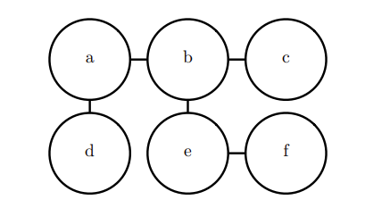

# 16. 结构化概率模型

## 16.1 非结构化建模的挑战

### 概率模型的任务

- **估计密度函数**
  - 给定一个输入 x，机器学习系统返回一个对数据生成分布的真实密度函数 p(x) 的估计。
- **去噪**
  - 给定一个受损的或者观察有误的输入数据 x˜，机器学习系统返回一个对原始的真实 x 的估计。
- **缺失值的填补**
  - 给定 x 的某些元素作为观察值，模型被要求返回**部分或全部未观察值**的估计/概率分布。
- **采样**
  - 模型从分布 p(x) 中抽取新的样本。

### 概率模型存在的问题

主要表现在面对**大规模随机变量**时。

#### 内存开销

- 假设x的分布为：n个离散变量，每个变量可取k个值。则可用含有$k^n$项的表格(或Python中的多维数组/字典)表示 P(x)。

示例代码：

```python
import itertools
import random
import time
import psutil
import os

n = 25 # 变量的个数
k = 2  # 每个变量可以取的值数

# 记录开始时间和初始内存
start_time = time.time(
process = psutil.Process(os.getpid())
start_memory = process.memory_info().rss / (1024 * 1024)  # 转换为MB

# 初始化表格，使用字典存储联合分布
P = {}

# 生成所有可能的组合并赋予随机概率
for combo in itertools.product(range(k), repeat=n):
    P[combo] = random.random()  # 为每个组合赋予随机概率

# 记录结束时间和最终内存
end_time = time.time()
end_memory = process.memory_info().rss / (1024 * 1024)  # 转换为MB

# 计算时间和内存开销
execution_time = end_time - start_time
memory_usage = end_memory - start_memory

# 输出时间和内存开销
print(f"建立表格的时间开销: {execution_time:.6f} 秒")
print(f"建立表格的内存开销: {memory_usage:.6f} MB")

# 示例：输出部分联合分布
print("\n部分联合分布:")
for i, (key, value) in enumerate(P.items()):
    print(f"P{key} = {value:.6f}")
    if i >= 5:  # 仅输出前 6 项
        break

# 输出：
# 建立表格的时间开销: 30.141879 秒
# 建立表格的内存开销: 9505.300781 MB(约9G)
```

#### 统计开销

#### 推理开销

#### 采样开销

P506

## 16.2 使用图描述模型结构

### 图论

在学习**结构化概率模型**之前，了解**图论**的相关知识非常重要，因为很多概率模型（如**贝叶斯网络**和**马尔可夫随机场**）都可以用图来表示。图论是研究图这种数学结构的学科，图论中的概念为我们描述和分析复杂的概率关系提供了有力工具。

#### 基本概念

1. **图（Graph）**：由**节点**（vertices）和**边**（edges）组成，表示对象及其关系。
   - **有向图**：边有方向，表示单向关系。
   - **无向图**：边无方向，表示双向关系。

2. **节点（Node/Vertex）**：图中的基本元素，代表个体或变量。

3. **边（Edge）**：连接节点的线，表示节点间的关系。

4. **邻居（Neighbors）**：通过边相连的节点，表示两个变量直接相关。

5. **路径（Path）**：从一个节点到另一个节点的连接方式。

6. **环（Cycle）**：路径起点和终点是同一个节点。

#### 图的类型

1. **有向无环图（Directed Acyclic Graph, DAG）**：
   - **DAG** 是一种没有环的有向图。在概率模型中，DAG 通常用于构建**贝叶斯网络**。每个节点表示一个随机变量，有向边表示因果关系或条件依赖关系。
   - **无环性**意味着从一个节点出发，无法通过有向边返回该节点。

2. **无向图（Undirected Graph）**：
   - 无向图的边没有方向，常用于**马尔可夫随机场（Markov Random Field, MRF）**等模型。边表示两个节点之间的对称依赖关系。

#### 图的相关概念在结构化概率模型中的应用

1. **贝叶斯网络（Bayesian Network）**：
   - 是一种使用有向无环图（DAG）表示的结构化概率模型。每个节点表示一个随机变量，每条有向边表示条件依赖关系。贝叶斯网络通过结构化的方式刻画了变量之间的条件独立性。

2. **马尔可夫随机场（Markov Random Field, MRF）**：
   - 是一种使用无向图表示的结构化概率模型。每个节点表示随机变量，边表示变量之间的相互依赖。无向图表示变量之间的联合概率分布和无条件的依赖关系。

### 有向模型(Directed Model)

- 可视化参数减少量
为什么是k-1?

### 无向模型(Undirected Model)

所有边均无方向，也称为**马尔科夫随机场/马尔科夫网络**。无向图模型不直接表示变量之间的**因果关系**，而是强调它们的**直接相互作用**。

#### 团（Clique）与团势能（Clique Potential）

在无向图中，一个**团**（clique）是节点的一个**完全连接子集**，意味着子集中任意两个节点之间都有一条边。

每个团都有一个对应的**因子**（factor）或**团势能**（clique potential）\( \phi(C) \)，用于衡量团中变量每一种可能的联合状态的**密切程度**。因子/团势能均被限制为**非负的**。

例如，考虑一个描述你、你的室友和同事健康状况的模型。假设你们之间存在感冒的传播，你和室友之间、你和同事之间都有可能相互感染。在这种情况下，团的因子可以用一个表来定义，其中状态 1 代表健康，状态 0 代表感染。这样的设计使得健康状态的联合概率最大，而单个人生病的情况则是较低的概率。

？以上

#### 未归一化概率函数(Unnormalized probability function)

##### 定义

$$
\tilde{p}(x) = \prod_{C \in G} \phi(C)
$$
其中$\phi(C)$表示上文提到的**因子/团势能**。

？？？##### 为什么需要未归一化概率函数？

未归一化概率函数在无向图模型中起到**连接复杂概率关系和实际应用**的**桥梁**作用。

这个函数为给定的变量状态 \( x \) 提供了一种方式来计算联合概率。然而，由于未归一化的概率函数不能保证所有概率之和为 1，因此需要进行归一化处理。

#### 配分函数与归一化

为了确保模型输出有效的概率分布，我们需要使用**配分函数**（partition function）\( Z \)，它确保所有的概率之和或积分为 1：
$$
p(x) = \frac{1}{Z} \tilde{p}(x)
$$
其中，配分函数 \( Z \) 通常通过对所有可能状态 \( x \) 的联合分布空间求和或积分得到：
$$
{Z} = \int \tilde{p}(x) \, \mathbb{d}x
$$
在实际应用中，计算 \( Z \) 可能非常复杂。为此，我们需要设计**模型的结构和因子的定义**，使得 \( Z \) 的计算尽可能高效。

#### 基于能量的模型(Energy-based model,EBM)

$$
\tilde{p}(x) = \exp(-E(x))
$$

$E(x)$：能量函数(Energy function)，显然$\tilde{p}(x)$恒正。符合上式的分布可被称为**玻尔兹曼分布(Boltzmann distribution)**，具有该分布的模型被称为**玻尔兹曼机(Boltzmann Machine)。**没有**潜变量**(**latent variables**，在模型中不可观测的隐含特征或状态，如模型学习到的潜在特征或结构)的玻尔兹曼机被称为**马尔可夫随机场**或**对数线性模型**。

##### 专家(Expert)

根据$$\exp(a + b) = \exp(a) \cdot \exp(b)$$，能量函数可被拆为$\exp(a)$,$\exp(b)$等**多个项**，对应无向模型中的**不同团**，每个团都可被视为一个“**专家**”，决定一个特定的软约束是否能够被满足；每个专家执行的一个约束，对应随机变量的一个**低维投影**。不同专家的乘法，共同构成了复杂的高维约束。

例如书中的无向图模型：$E_{a,b}(a, b)$,$E_{b,c}(b, c)$等均可被视为不同“专家”，所有专家/项共同构成整体能量函数$E(a,b,c,d,e,f)$。
$$
E(a, b, c, d, e, f) = E_{a,b}(a, b) + E_{b,c}(b, c) + E_{a,d}(a, d) + E_{b,e}(b, e) + E_{e,f}(e, f)
$$


#### 无向图如何表示间接相互的变量？

