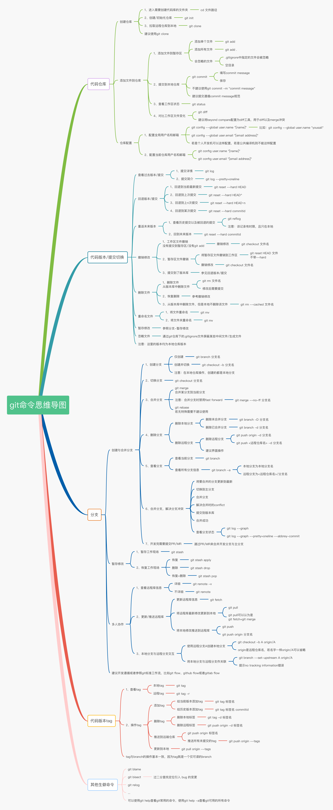

# 15. 表示学习 + 16. 结构化概率模型

## Tasks

- **ddl:10/10**
  - [ ] 撰写、优化笔记(.md格式)
  - [ ] 补充更多的代码示例
    - 可做成**Jupyter Notebook**的形式，像d2l一样
  - [ ] 提交Pull Request

## Introduction

- `tmp`是我建的临时文件夹，用于分享一些笔记草稿、代码草稿、资源等等，最后Pull Request前会删掉
  - 结构：
    - `src`：资源分享
    - `code`：代码
    - `notes`：笔记草稿

- 花书(我们看的那本书)：
  - [中文版](src/深度学习(花书).pdf)
  - [英文版](src/DeepLearningBook_English.pdf)
- markdown格式：[markdown官方教程](https://markdown.com.cn/basic-syntax/)
- Latex教程：[Latex入门](src/LaTeX入门.pdf)
  - Latex一般是写电子书/论文用，我们做笔记不是必需
- d2l(动手学深度学习)
  - [中文版](src/动手学深度学习-PyTorch(第二版).pdf)
    - 我觉得中文版翻译比花书好，这本书也许有我们可以借鉴的代码
    - [d2l-Github地址](https://github.com/d2l-ai/d2l-zh)
  - [英文版](<src/Dive into Deep Learning.pdf>)
- Git
  - 我们导师说，会`git clone`,`git add`,`git commit`,`git push`就够了，也确实是这样的
    - 导师给我们推荐的[教程](https://liaoxuefeng.com/books/git/introduction/index.html)
    - 这张图感觉也挺好
  - 以后我们可以用Github分享代码，比如你把这个仓库克隆到本地之后可以运行我上传的一个[测试代码](code/test.py)
