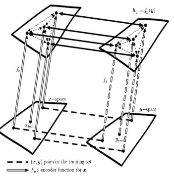

# 15. Representative-learning

## Intro

Hypothesis

: Unlabeled data can be used to learn a good representation.

- Supervised & semi-supervised & unsupervised learning
  - Supervised learning:
    - Training with supervised learning techniques on the labeled subset often results in severe overfitting.
  - semi-supervised learning:
    - Also learning from the unlabeled data
    - learn good representations -> unlabeled data: Possible
    - 

## 15.1 Greedy Layer-Wise Unsupervised Pretraining

- A representation learned for one task can sometimes be useful for another task(SL).
  - Unsupervised Pretraining -> Train a DSN(deeo supervised network) without convolution or recurrence

### Compose

- Layer -> pretrained by unspervised learning -> simpler output for nexe Layer
  - A single-layer representation learning algorithm
    - RBM
  - A single-layer autoencoder
  - A sparse coding model

```algorithm 15.1(Pseudocode-伪代码)

```

### Effect

(there are some citations in the book)

- Sidestep the difficulty of jointly training the layers of NNs(supervised task)
  - **Initialization** for a joint learning
    - Even fully-connected architectures
    - for other unsupervised learning algorithms:
      - deep autoencoders, probabilistic models with many layers of latent variables
        - models above:
          - deep belief networks
          - deep  Boltzmann machines

### Interpretation

- **greedy**：optimizes each piece of the solution independently
- layer-wise: proceeds one layer while freezes the previous one(s)?
- unsupervised
- pretraining: the first step before joint fune-tuning
  - Regularizer(正则化) / parameter initialization
  - Common use of pretraining:
    - Pretraining
    - Supervised learning
      - training a classifier based on pretraining phase
      - or supervised fine-tuning

### Why Does Unsupervised Pretraining Work?

#### Combination of two different ideas:

- Initial parameters -->> Regularizing effect on the model
  - Out-of-date idea: Local initialization -> Local Minimum
  - Now:
    - standard neural network  training procedures usually do not arrive at a critical point
    - Local-pretraining-initialization -> Inaccessible areas
  - Problems:
    - What unsupervising-pretrained parameters should be retained for supervised learning next?
      - UL + SL at the same time
        - Another reason: the **constraints** imposed by the output layer are naturally included from the start.
      - (or)Freezing the parameters for the feature extractors
  - But how unsupervised pretraining can act as a regularizer?
    - One hypothesis:
    > Pretraining encourages the learning algorithm to discover  features that relate to the underlying causes that generate the observed data.

- Learning input distribution helps **mapping** from inputs to outputs
  - basis: Features that are useful for the unsupervised task may also be useful for the supervised learning task
    - The effectiveness of features learned through unsupervised training heavily depends on the specific model architecture. For example, a top-layer linear classifier requires features that make the underlying classes linearly separable.

#### When the initial representation is poor, unsupervised will be more effective.

- Example:
  - Word embeddings
    - Idea: Unsupervised pretraining as learning a representation.
    - One-hot vector representation: can't quantify **distance** between vectors
    - Embeddings: encode similarity -> better for processing words
  - Less labeled examples scenerios
    - Idea: Unsupervised pretraining as a regularizer.

#### When the function to be learned is extremely complicated, UP is more useful.

> Unsupervised learning differs from regularizers like weight decay because it does not bias the learner toward discovering a simple function but rather toward discovering feature functions that are useful for the unsupervised learning task.

Complicated function is too much for regularizers like **weight decay**[^1].

### Application

- Improve classifiers & reduce test set errors
- Improve optimization
  - Why? --UP takes the parameters into a region that would otherwise be
inaccessible.
    - Why inaccessible?
      - gradient becomes small
      - early stop(to prevent overfitting)
      - the gradient is large but it is difficult to find a downhill step due to problems such as **stochasticity** or poor conditioning of the **Hessian**.
    - Pretraining reduces the variance of the estimation process,initializes neural network parameters into a region that they do not escape
      - results: more consistent
      - 

### Disadvantages

- Two separate training phases:
  - Too many hyperparameters -> Effects can't be predicted before the try
    - UL + SL without P: one single decisive parameter
  - Different hyperparameters in two phases：
    - Params -> Forward feedback -> Gradient calculate -> Backward feedback -> Update params

### Today

- Scale of labeled dataset:
  - Large & Medium: SL + **Dropout/batch normalization**
  - Small: Batesian methods

- Milestone effect:
  - SP for transfer learning -> Convolutional networks
  - Transfer learning and domain adaptation

## 15.2 Transfer Learning and Domain Adaptation

### Transfer Learning

UL for transfer learning:

learning a good feature space -> well-trained linear classifer from limited labeled examples

#### Forms

##### One-shot learning

- One labeled example -> Learning a good feature space -> Infering all cluster around the same point
  - variation
  - invariation(clustered)

##### Zero-shot learning

- 3 random vars:
  - x
  - y
  - T(description of tasks)
    - > If we have a training set containing unsupervised examples of objects that live in the same space as T, we may be able to infer the meaning of unseen instances of T.
    - T needs generalization: can't be one-hot code
- Jointly learning:
  - representation_1 in space A
  - representation_2 in space B
  - relations between 1 and 2 or A and B
    - Take advantage of related respective feature vectors
- Related: Multi-modal learning

#### Input semantics

Representation learning -> transfer learning, multi-task learning, and domain adaptation.

- e.g. Visual Categories: low-level notions of edges and visual shapes sharing

#### Output semantics

Task-specific lower-level + Shared upper-level

### Domain adaptation

- e.g. Sentiment analysis(data from web)
  - vocabulary and style vary from domains
- concept drift: a form of transfer learning

### Multi-task learning

- Typically refers to SL, also for UL or RL(reinforcement).
- the same representation may be useful in both settings <--> representation benefits from both tasks

## 15.3 Semi-Supervised Disentangling of Causal Factors

### What makes one representation better than another?

#### Better representation

> The features within the representation correspond to the underlying causes of the observed data, with separate features or directions in feature space corresponding to different causes, so that the representation disentangles the causes from one another.

- Better p(x) -> Better p(y|x).

> A representation that cleanly separates the underlying causal factors may not necessarily be one that is easy to model.

!P744-数学公式

- In practice: Is Brute force solution possible?
  - BFS:Captures all h_j and disentangles them, then predict y from h.
    - Can'tcapture all factors of variation
  - What to encode?
    - SL + UL Signals
    - Only UL with larger representations

#### Definition Modifying

- Fixed criterion: mean squared error
  - failed when identifying "less" salient elements, like small ping-pong ball
- Solution: **GAN(generative adversarial networks)**(Are there more state-of-the-art solutions nowadays?)
  - What's salient element? -all structured pattern that the **feedforward network** can recognize.
  - GAN helps learning the underlying causal factors.
    - Benefit: x-effect; y-cause; **modeling p(x | y) is robust to changes in p(y)**.
    - Or: the causal mechanisms remain invariant, while the **marginal distribution** can change.

## 15.4 Distributed Representation

P748