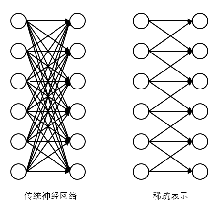
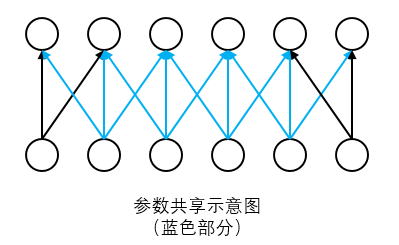

# 卷积网络

参考原书定义：卷积网络是指那些至少在网络中的一层使用卷积运算来代替一般矩阵乘法预算的神经网络。

卷积运算的具体步骤参考原书相关章节，这里重点介绍卷积网络的三个重要的思想来改进神经网络的：稀疏表示、参数共享和等变表示。

+ 稀疏表示：传统神经网络中，每一个输入单元和输出单元都有交互，通过矩阵乘法来表示这种连接关系。卷积层则只对卷积核覆盖到的范围产生交互，其他连接都为0，进而达到输入单元至输出单元的稀疏表示。
+ 参数共享：传统神经网络中，权重矩阵中的每一个元素只会使用一次，不会在不同的函数间共享参数。而卷积网络中，卷积核的元素集合被共享地共同作用在每一个输入元素中。这个设计保证了我们只需
要学习一个参数集合，而不用对每一位置去学习一个单独的参数。这个优势是可以极大地降低网络的存储空间。
+ 等变表示：大多数的卷积网络中，卷积层和池化层会配合使用，通过这两个先验，可以学习出平移不变性、旋转不变性。通过卷积核池化层，可以在网络的越后端获得越多的感知视野（接受域）。

## 本节目录
1. [简单卷积网络示例](简单卷积网络.md)
1. [经典CNN模型(LeNet and AlexNet)](卷积网络进阶.ipynb)

下面我们看一下稀疏表示和参数共享的示意图

