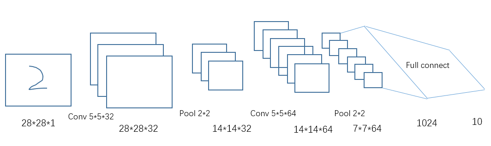

# 简单卷积网络

本节将介绍如何在MNIST数据集中，搭建一个简单的卷积神经网络，使用Tensorflow训练，进行手写字体的识别。

## 代码环境
1. Python 3.5.4
1. Tensorflow 1.3.0
1. Jupyter 5.0.0


## 代码示例
+ import 需要使用的模块
```python
import tensorflow as tf
from tensorflow.examples.tutorials.mnist import input_data
import time
```
+ 权重向量（weight 和 bias）的定义和初始化，tf.truncated_normal可以从一个正态分布片段中输出随机数值，变量shape 是输出张量的形式，和网络结构设计有关。

```python
def weight_variable(shape):
    initial = tf.truncated_normal(shape, stddev=0.1)
    return tf.Variable(initial)

def bias_variable(shape):
    initial = tf.constant(0.0, shape=shape)
    return tf.Variable(initial)
```
+ 卷积网络层的定义,tf.nn.conv2d是TensorFlow里面实现卷积的函数（读者也可以自己实现卷积操作）。其中：
    + x是输入，即训练时输入的每一个batch。
    + W是CNN中的卷积核，它要求是一个Tensor，具有[filter_height, filter_width, in_channels, out_channels]这样的shape，具体含义是[卷积核的高度，卷积核的宽度，图像通道数，卷积核个数]，要求类型与参数input相同。
    + strides：卷积时在图像每一维的步长，一个一维的向量，本例中每个步长为1. [1, 1, 1, 1]
    + padding：string类型的量，只能是"SAME","VALID"其中之一，这个值决定了不同的卷积方式

```python
def conv2d(x, W):
    return tf.nn.conv2d(x, W, strides=[1, 1, 1, 1], padding="SAME")
```
+ max pooling 层的定义,其中：
    + x 是需要池化的输入，一般池化层接在卷积层后面，所以输入通常是feature map，依然是[batch, height, width, channels]这样的shape。
    + ksize：池化窗口的大小，取一个四维向量，一般是[1, height, width, 1]，因为我们不想在batch和channels上做池化，所以这两个维度设为了1
    + strides：和卷积层的定义类似，窗口在每一个维度上滑动的步长，一般也是[1, stride,stride, 1]
    + padding：和卷积层的定义类似，可以取'VALID' 或者'SAME'
    + 返回一个Tensor，类型不变，shape是[batch, height, width, channels]的形式

```python
def max_pool_2x2(x):
    return tf.nn.max_pool(x, ksize=[1, 2, 2, 1], strides=[1, 2, 2, 1], padding="SAME")
```

+ 数据输入: 图片大小为28*28，单通道；输出类别为10类（0-9）

```python
    mnist = input_data.read_data_sets("../data/MNIST_data/", one_hot=True)
    x = tf.placeholder(tf.float32, [None, 28 * 28])
    y_ = tf.placeholder(tf.float32, [None, 10])

    x_image = tf.reshape(x, [-1, 28, 28, 1])
```
+ 定义网络结构, 本实例中的网络结构如图：




```python
   # convolution 1
    W_conv1 = weight_variable([5, 5, 1, 32])
    b_conv1 = bias_variable([32])
    h_conv1 = tf.nn.relu(conv2d(x_image, W_conv1) + b_conv1)

    # max pool 1
    h_pool1 = max_pool_2x2(h_conv1)

    # convolution 2
    W_conv2 = weight_variable([5, 5, 32, 64])
    b_conv2 = bias_variable([64])
    h_conv2 = tf.nn.relu(conv2d(h_pool1, W_conv2) + b_conv2)

    # max pool 2
    h_pool2 = max_pool_2x2(h_conv2)
    h_pool2_flat = tf.reshape(h_pool2, [-1, 7 * 7 * 64])

    # full connect 1
    W_fc1 = weight_variable([7 * 7 * 64, 1024])
    b_fc1 = bias_variable([1024])
    h_fc1 = tf.nn.relu(tf.matmul(h_pool2_flat, W_fc1) + b_fc1)

    # 如果有需要，可以添加drop out
    keep_prob = tf.placeholder(tf.float32)
    h_fc1_drop = tf.nn.dropout(h_fc1, keep_prob)

    # softmax
    w_softmax = weight_variable([1024, 10])
    b_softmax = bias_variable([10])
```

+ 定义损失函数和迭代运行。本实例中使用直接计算cross entropy的方法，也可以使用tf.nn.softmax_cross_entropy_with_logits函数来计算交叉熵。

```python
    y = tf.nn.softmax(tf.matmul(h_fc1_drop, w_softmax) + b_softmax)
    cross_entropy = -tf.reduce_sum(y_ * tf.log(y))

    update = tf.train.GradientDescentOptimizer(0.0001).minimize(cross_entropy)

    correct_prediction = tf.equal(tf.arg_max(y, 1), tf.arg_max(y_, 1))
    accuracy = tf.reduce_mean(tf.cast(correct_prediction, tf.float32))

    with tf.Session() as sess:
        sess.run(tf.initialize_all_variables())
        start = time.time()
        for i in range(50000):
            xs, ys = mnist.train.next_batch(50)
            if i % 1000 == 0:
                timecos = time.time() - start
                start = time.time()
                print("Step: {:d},Accuracy: {:.3f}, timeCos: {:.1f}".
                      format(i,
                             sess.run(accuracy,
                                      feed_dict={x: mnist.validation.images,
                                                 y_: mnist.validation.labels,
                                                 keep_prob: 1.0
                                                 }),
                             timecos * 1000 / 50
                             )
                      )
            sess.run(update,
                     feed_dict={x: xs, y_: ys, keep_prob: 0.5})

```

训练完之后，本案例在GPU Tesla P4上面，单卡训练大概需要5-10分钟，如果是CPU时间会比较长，最终精度达到99.1%。
> 本案例的完整代码在 [简单卷积网络示例完整代码](src/simple-mnist-CNN.ipynb) 代码参考自：共享者 [Jipeng Huang](https://github.com/hjptriplebee)
