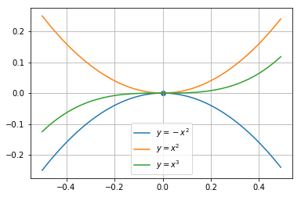
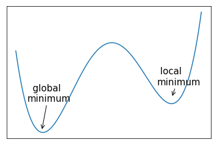
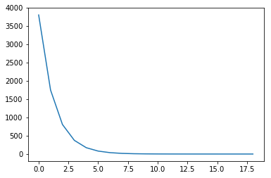

# 数值计算

&emsp;&emsp;对于机器学习中的问题，有一部分可以通过数学推导的方式直接得到用公式表达的解析解，但对绝大多数的问题来说，解析解是不存在的，需要使用迭代更新的方法求数值解。然而实数的精度是无限的，计算机能够表达的精度是有限的，这就涉及到许多数值计算方法的问题。

## 1. 基本概念

+ 上溢和下溢：由于计算机表达实数的精度的有限，在某些情况下许多复杂的复合运算中的四舍五入会导致一个接近0的小数变为0或者一个非常大的数被认为是无穷，这都会导致很严重的后果。

+ 病态条件：条件数指的是函数相对于输入的微小变化而变化的快慢程度，输入被轻微扰动而迅速改变的函数对于科学计算来说可能会出现问题。

+ 目标函数，损失函数(Objective function, Loss function)：在求解机器学习问题时需要最大化或者最小化的函数目标。

+ 导数：对于单变量函数$f(x)$来说，其导数$f^\prime(x)$表示在$f(x)$在x的斜率大小。

+ 偏导数：多变量函数针对某单一变量的导数，例如$f(x,y)$相对与$x$的偏导数为$\frac{\partial f}{\partial x}$。

+ 梯度：梯度是一个向量，向量中的元素是函数的偏导数，对于$f(x,y)$来说，其梯度$\nabla f = (\frac{\partial f}{\partial x}, \frac{\partial f}{\partial y})$，梯度表示函数在当前变化最快的方向。

+ 雅克比矩阵(Jacobian Matrix)：对于函数$\boldsymbol{f}: R^m \rightarrow R^n$，其雅克比矩阵$\boldsymbol{J} \in R^{n \times m}$被定义为$J_{i,j}=\frac{\partial f(\boldsymbol(x))_i}{\partial x_j}$。

+ 海森矩阵(Hessian Matrix)：对于函数$f: R^n \rightarrow R$，其海森矩阵$\boldsymbol{H}$是二阶导数组成的矩阵，被定义为$H_{i,j}=\frac{\partial^2 f}{\partial x_i \partial x_j}$。

+ 极值点&鞍点：当对于函数$f(x)$来说，其导数等于0的点可能会存在的情况如下图所示，$x=0$点对图中三个函数来说分别是极大值点、极小值点、鞍点（非极值点）。对于多层的神经网络来说，鞍点是非常常见的，在迭代优化的时候需要使用一些方法跳出。



+ 全局最小点：在函数的定义域上取得全局最小值的点，这通常来说是许多机器学习问题所要寻找的优化目标点。对神经网络中问题的损失函数来说，可能存在很多的的局部最小点，它们与全局的最小点差距不大，应此通常也可以作为问题的解，下面是一个示例。



## 2. 基于梯度的优化方法

+ 梯度下降法：根据导数的计算公式，可以有$f(x+\epsilon) \approx f(x) + \epsilon f^\prime(x)$，为了求到目标函数的最小值，我们可以将$x$向梯度的相反方向移动一小段距离来进行逼近。

+ 一阶优化算法：仅适用梯度信息的优化算法，如梯度下降法。

+ 二阶优化算法：使用海森矩阵进行优化的算法，如牛顿法。

+ 约束优化：在求解优化目标时，可能需要在函数定义域的某个子集中得到极值，这种条件下的优化问题被称为约束优化，一般使用构造拉格朗日函数利用KKT条件的方法求解。

## 3. 利用梯度下降法求解的实例

### 问题

&emsp;&emsp;假设有一些样本点$\boldsymbol{X}$和对应的目标$\boldsymbol{y}$，已知$\boldsymbol{y}$可以由$f(\boldsymbol{x}) = \boldsymbol{w \cdot x}+ b$加上噪音生成，求解函数$f$的参数$\boldsymbol{w}$和$b$。

### 求解

&emsp;&emsp;首先定义$f(\boldsymbol{x})$相对于$y$的损失函数

$$L(f,y) = \frac{1}{2}\sum_{\boldsymbol{x}} (f(\boldsymbol{x})-y)^2 = \frac{1}{2}\sum_{\boldsymbol{x}}(\boldsymbol{w \cdot x}+b - y)^2$$

那么损失函数相对于参数$\boldsymbol{w}$和$b$的导数分别为:

$$\frac{\partial L}{\partial \boldsymbol{w}} = \sum_{\boldsymbol{x}} \boldsymbol{x}(\boldsymbol{w \cdot x} + b - y)$$

$$\frac{\partial L}{\partial b} =  \sum_{\boldsymbol{x}} (\boldsymbol{w \cdot x} + b - y)$$

根据梯度下降法的公式可以得到参数的更新公式：

$$\boldsymbol{w} = \boldsymbol{w} - \eta \frac{\partial L}{\partial \boldsymbol{w}}$$

$$b = b - \eta \frac{\partial L}{\partial b}$$

下面是利用numpy实现上述过求解的代码
>这些代码可以在我们提供的jupyter notebook示例[gradient descent example](src/gradient_descent_example.ipynb)中直接运行查看。

```python
import numpy as np
import matplotlib.pyplot as plt

## 定义w和b
feature_num = 10
w_real = np.random.random(feature_num)
b_real = np.random.random()

## 生成训练数据
instance_num = 1000
X = np.random.uniform(-100,100,(feature_num, instance_num))
y = np.matmul(w_real, X) + b_real
y = y + np.random.random(y.shape)

## 初始化参数
w = np.random.random(feature_num)
b = np.random.random()

iter_time = 20
step_size = 0.0001
loss_value = []

## 迭代求解
for i in range(iter_time):
    delta = np.matmul(w, X) + b_real - y
    loss_value.append((delta*delta).mean())
    w = w - step_size*(np.matmul(delta, X.T))/instance_num
    b = b - step_size*delta.mean()
plt.clf
plt.plot(np.array(loss_value[1:]))
plt.show()
```

运行上述代码可以得到是迭代过程中的损失变化情况，如下图示：



最后可以实际观察一下w和w_real的值，可以看到经过梯度迭代，确实可以得到参数的值。

```python
>>>w
array([ 0.79842335,  0.42003747,  0.04151777,  0.05549998,  0.71396875,
        0.60893848,  0.19337114,  0.42662969,  0.27833712,  0.63035355])
>>>w_real
array([ 0.79855966,  0.41969485,  0.04192018,  0.05457261,  0.7145736 ,
        0.60895623,  0.19295485,  0.42620365,  0.27826274,  0.63047412])
```

上面的示例中，可以根据梯度迭代公式很容易且快速的迭代算出参数值，然而实际的机器学习问题往往比上面的问题复杂的多，因此迭代过程也不像上面的例子一样简单，而是涉及到许多技巧，在后续的章节中我们将根据学习进程对这些方法逐一介绍。