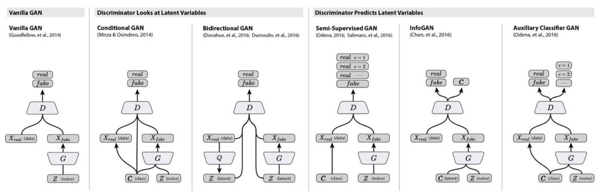
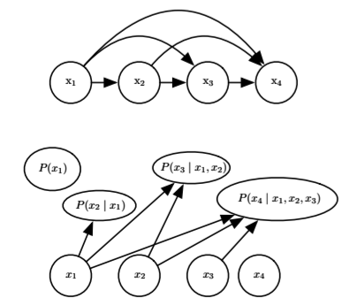
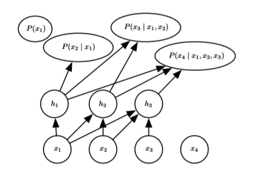
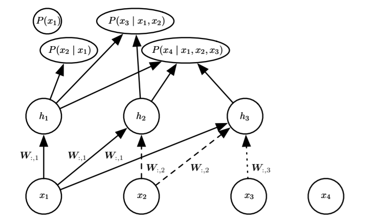

### Sigmoid 信念网络

sigmoid 信念网络（Sigmoid Belief Nets）是一种具有特定条件概率分布的有向图模型的简单形式。可以将 sigmoid 信念网络视为具有二值向量的状态 s，其中状态的每个元素都受其祖先影响：

$$p(s_i)=σ(\sum_{j< i}W_{j,i}s_j+b_i)$$

sigmoid 信念网络最常见的结构是被分为许多层的结构，其中原始采样通过一系列多个隐藏层进行，然后最终生成可见层。
这种结构与深度信念网络非常相似，但它们在采样过程开始时的单元彼此独立，而不是从受限玻尔兹曼机采样。

sigmoid 信念网络的训练常用**变分推断**或**MCMC采样**方法进行。具体训练过程通常包括以下步骤：

- 通过后验采样，给定观察数据推断隐藏变量的分布。
- 使用似然函数进行优化，更新模型的参数（如权重和偏置）。

由于 sigmoid 信念网络的有向结构和随机性，在推断过程中需要计算隐层的后验分布，这通常需要近似算法，因为精确推断是计算上不切实际的。

### 可微生成器网络

可微生成器网络（Differentiable Generator Nets）是很多生成模型的基础，其使用**可微函数** $g(z;θ(g))$ 将潜变量 $z$ 的样本变换为样本 $x$ 或样本 $x$ 上的分布。可微函数常可以由神经网络表示。

我们可以认为 $g(z;θ(g))$ 提供了变量的非线性变化，将 $z$ 分布变换成想要的 $x$ 分布。

在某些情况下，我们使用 $g(z;θ(g))$ 来定义 $x$ 上的条件分布。例如，我们可以使用一个生成器网络，其最后一层由 sigmoid 输出组成，可以提供 Bernoulli 分布的平均参数：

$$p ( x i = 1 ∣ z ) = g ( z ) i $$

当生成器网络**在 $x$ 上定义条件分布时**，它不但能生成连续数据，也能生成离散数据。
当生成器网络**直接提供采样时**，它只能产生连续数据，优点是不再被迫使用条件分布。

### 变分自编码器

变分自编码器（Variational Autoencoders）是一个使用学好的近似推断（Learned Approximate Inference）的有向模型，  可以纯粹地使用**基于梯度**的方法进行训练。

变分自编码器的训练如下：
- 近似推断网络 $q(z \mid x)$ 输出潜在变量 $z$ 的均值和方差;
-  从编码分布，即潜在空间 $p_{model}(z)$ 中，采样 $z$；
- 将样本输入到可微生成器网络 $g(z)$ 中；
- 从分布 $p_{model}(x;g(z)) = p_{model}(x \mid z)$ 中采样 $x$；
- 通过最小化损失函数（重构损失和 KL 散度）更新模型的参数。

其中，近似推断网络（或记作**编码器网络**）$q(z \mid x)$用于获得 $z$，而 $p_{model}(x \mid z)$则被视为**解码器网络**。  

变分自编码器背后的关键思想是，它们可以通过最大化与数据点 $x$ 相关联的变 分下界 $L(q)$ 来训练：

$$log p_{model}(x)\geq L(q)=E_{z\sim q(z|x)}[log;p_{model}(x|z)]-D_{KL}(q(z|x)||p_{model}(z))$$

最后，变分自编码器方法是优雅的，易于实现的，也获得了不错的结果，是生成式建模中的最先进方法之一；它的主要缺点是从在图像上训练的变分自编码器中采样的样本往往有些模糊。

### 生成式对抗网络

生成式对抗网络（Generative Adversarial Networks, GAN）是基于可微生成器网络的另一种生成式建模方法。

GAN由两个网络组成：
- **生成器（G）**：生成器接收一个随机噪声（通常是从正态分布或均匀分布中采样的），并尝试生成与真实数据分布尽可能相似的数据。
- **判别器（D）**：判别器负责区分真实数据和生成数据，输出是真或假的概率。

生成器（G）的输入是随机噪声 $z$，通过神经网络生成样本 $G(z)$，这些样本应该尽可能逼近真实数据的分布。生成器的目标是通过优化，使得判别器将其生成的数据误判为真实的。

生成器的损失函数可以表示为：
$$\mathcal{L}_G = \mathbb{E}_{z \sim p_z(z)} [\log(1 - D(G(z)))]$$
该目标是通过最小化判别器对生成数据的错误判断来更新生成器的参数。

判别器（D）是一个二分类模型，用来判断输入数据是真实的还是由生成器生成的。它会输出一个介于0到1之间的概率，其中1表示数据是真实的，0表示数据是生成的。判别器的目标是最大化它对真实数据的预测，并最小化对生成数据的错误预测。

判别器的损失函数可以表示为：
$$\mathcal{L}_D = -\left( \mathbb{E}_{x \sim p_{\text{data}}(x)} [\log D(x)] + \mathbb{E}_{z \sim p_z(z)} [\log(1 - D(G(z)))] \right)$$
这里的目标是最大化对真实数据的判断正确性，同时最小化对生成数据的判断错误性。

GAN的训练是一个对抗性过程，生成器和判别器交替更新，每一次迭代都可以分为两个步骤：
1. **更新判别器（D）**：
   - 使用一批真实数据样本计算判别器的损失，最大化 $\log D(x)$。
   - 使用一批由生成器生成的伪造数据计算判别器的损失，最小化 $\log(1 - D(G(z)))$。
   - 更新判别器的参数，使其能够更好地区分真实数据和生成数据。

2. **更新生成器（G）**：
   - 生成一批伪造数据，通过判别器计算生成器的损失，最小化 $\log(1 - D(G(z)))$。
   - 更新生成器的参数，使其生成的数据能够更好地欺骗判别器。

GAN的整体目标可以看作是一个**极小极大博弈**问题：
$$\min_G \max_D \mathbb{E}_{x \sim p_{\text{data}}(x)} [\log D(x)] + \mathbb{E}_{z \sim p_z(z)} [\log(1 - D(G(z)))]$$
生成器试图最小化这个损失函数，判别器试图最大化这个损失函数。最终的目标是生成器生成的数据分布尽可能接近真实数据分布，以至于判别器无法区分它们。

各种GAN的结构如下：

 

### 生成矩匹配网络

生成矩匹配网络（Generative Moment Matching Network, GMMN）是另一种基于可微生成器网络的生成模型。与传统的生成对抗网络（GAN）或变分自编码器（VAE）不同，GMMN的训练过程不需要将生成器网络与任何其他网络配对，更侧重于通过统计方法来匹配数据分布的矩（例如均值、方差、偏度等）。

GMMN的核心思想是利用**矩匹配**方法来实现生成数据的学习。

在概率论中，矩是随机变量的一种期望值，通常用于描述分布的特性。对于一维随机变量 $X$，其 $n$ 阶矩定义为：

$$\mu_n = \mathbb{E}[X^n]$$

其中，$\mu_1$​ 是均值，$\mu_2$​ 是方差，$\mu_3$​ 是偏度等。

矩匹配是一种通过比较概率分布的矩（如期望、方差等）来衡量和匹配分布的方法。在GMMN中，模型通过最小化生成分布与真实分布之间的矩差异，从而训练生成器。

这种矩差异可以通过**最大平均偏差**（maximum mean discrepancy, MMD）来实现。MMD作为训练的代价函数，通过向核函数定义的特征空间隐式映射，在无限维空间中测量第一矩的误差，使得对无限维向量的计算变得可行。当且仅当所比较 的两个分布相等时，MMD 代价为零。

GMMN通常包括以下几个部分：

- **生成器**（Generator）：生成器负责从随机噪声中生成样本数据。与传统的生成模型类似，生成器会将噪声输入转化为数据空间的样本。
    
- **判别器**（Discriminator）：判别器用于计算真实样本和生成样本的矩。判别器并不仅仅输出真假标签，而是计算样本的特征矩，以便评估生成样本与真实样本的相似度。

### 卷积生成网络

当生成图像时，将卷积结构引入生成器网络通常是有用的。

卷积生成网络（Convolutional Generative Networks, CGN）是一类使用卷积神经网络（CNN）结构进行数据生成的模型。CGN通常应用于图像生成任务，通过卷积层提取特征并生成高质量的图像。与传统的全连接生成网络不同，卷积生成网络能够更有效地处理空间信息，因而在图像生成和图像处理任务中表现更好。

### 自回归网络

自回归网络（Autoregressive Networks）是没有潜在随机变量的有向概率模型。这些模型中的条件概率分布由神经网络表示（有时是极简单的神经网络，例如逻辑回归）。这些模型的图结构是完全图。它们可以通过概率的链式法则分解观察变量上的联合概率，从而获得形如  $P(x_d | x_{d−1} , . . . , x_1 )$ 条件概率的乘积。这样的模型被称为完全可见的贝叶斯网络（fully-visible Bayes networks, FVBN），并成功地以许多形式使用。

### 线性自回归网络

自回归网络的最简单形式是没有隐藏单元、没有参数或特征共享的形式。每个 $P(x_i | x_{i−1} , . . . , x_1 )$ 被参数化为线性模型（对于实值数据的线性回归，对于二值数据的逻辑回归，对于离散数据的softmax回归）。

线性自回归网络本质上是线性分类方法在生成式建模上的推广。因此，它们具有与线性分类器相同的优缺点。像线性分类器一样，它们可以用凸损失函数训练，并且有时允许闭解形式（如在高斯情况下）。

 

完全可见的信念网络从前 $i − 1$ 个变量预测第 $i$ 个变量。

### 神经自回归网络

神经自回归网络\具有与逻辑自回归网络相同的从 左到右的图模型，但在该图模型结构内采用不同的条件分布参数。新的参 数化更强大，它可以根据需要随意增加容量，并允许近似任意联合分布。

 

神经自回归网络从前 $i − 1$ 个变量预测第 $i$ 个变量 $x_i$ ，但经参数化后，作为 $x_1 , . . . , x_i$ 函数的特征（表示为 $h_i$ 的隐藏单元的组）可以在预测所有后续变量 $x _{i+1} , x_{i+2} , . . . , x_d$ 时重用。

### 神经自回归密度估计器

神经自回归密度估计器（neural auto-regressive density estimator, NADE）是最近非常成功的神经自回归网络的一种形式，旨在进行概率密度估计。NADE通过结合深度学习的优势，能够有效建模高维数据的概率分布。

NADE的核心思想是将高维数据分解成条件概率的形式。给定一个观测变量 $x$，NADE通过自回归模型表示其概率分布：

$$p(x) = \prod_{i=1}^{D} p(x_i | x_{1}, x_{2}, \ldots, x_{i-1})$$

其中 $D$ 是数据的维度，$x_i$​ 是第 $i$ 个维度的变量。通过这种方式，NADE能够将高维分布转化为一系列一维条件分布的乘积。

 

隐藏单元被组织在组 $h_(j)$ 中，使得只有输 入 $x_1 , . . . , x_i$ 参与计算 $h_(i)$ 和预测 $p(x_i | x_{1}, x_{2}, \ldots, x_{i-1})$（对于 $j$ > $i$）。

### PyTorch案例

同目录下VAE文件夹
- VAE_Case.py：搭建VAE网络在MNIST数据集进行训练和生成
- loss_VAE.png：VAE训练损失图
- image_generative_last.png：VAE最后生成的图片

同目录下GAN文件夹
- GAN_Case.py：搭建GAN网络在MNIST数据集进行训练和生成
- image_generative_begin.png：GAN最初生成的图片
- image_generative_last.png：GAN最后生成的图片

同目录下DCGAN文件夹
- DCGAN_Case.py：搭建DCGAN网络在MNIST数据集进行训练和生成
- image_generative_begin.png：DCGAN最初生成的图片
- image_generative_last.png：DCGAN最后生成的图片