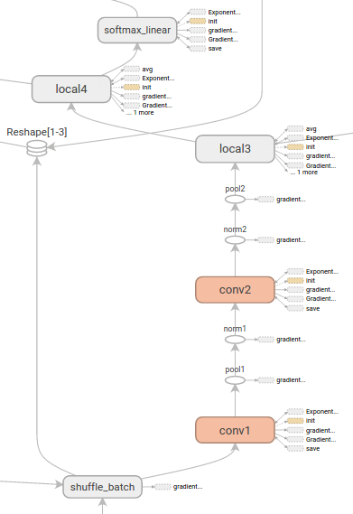
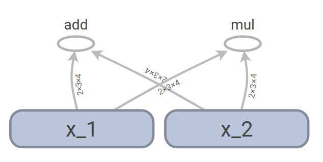
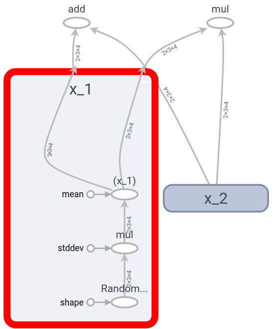
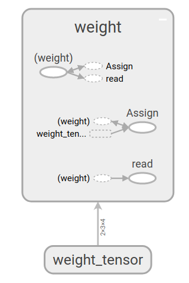
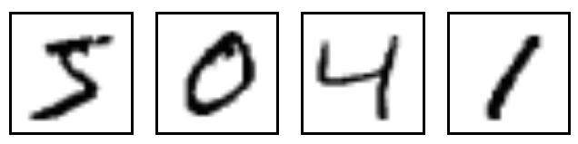

# TensorFlow实战

&emsp;&emsp;TensorFlow是由Google于2015年推出的一个通用的数值计算框架，它采用数据流图(Data Flow Graphs)来表示运算过程。图中的节点表示数学运算，边表示节点之间相互依赖和联系的张量（Tensor）。它可以运行在包括CPU平台，GPU平台，移动设备等在内的多种异构平台上，为深度学习的研究带来了巨大的便利。下图即为使用TensorFlow的可视化工具TensorBoard观察的一个数据流图示例。



> TensorFlow支持各个主流平台上的CPU和GPU作为运算单元，关于TensorFlow的安装方法这里不在赘述，可以参考官网的[安装教程](https://www.tensorflow.org/install/)。<br>
> 同时由于目前TensorFlow还处于快速发展的时期，新版本的推出和API的改变也可能会导致示例代码失效，遇到这种情况建议根据错误提示调试或者查询官方[release说明](https://github.com/tensorflow/tensorflow/releases)。

## 1. Tensor + Flow

&emsp;&emsp;TensorFlow的名字组成很直接的揭示了其最重要的两个概念：Tensor对应的`数据`和Flow对应的`数据流图`或`计算图`。使用Tensor和Flow这两个概念，可以把机器学习算法（一个复杂的数学运算或流程）分解为通过有向图连接的简单数学操作。一般TensorFlow程序的流程也主要分为两个步骤：1）定义算法的计算图结构；2）使用计算图执行计算。

## 2. 定义计算图

### 声明Tensor

&emsp;&emsp;Tensor是TensorFLow总的基本数据类型，它与numpy中的张量（多维数组）在概念和使用上十分的类似，可以通过以下的方式声明一些张量

```python
import tensorflow as tf
import numpy as np

# 声明一个常量的张量值
x_constant = tf.constant(np.arange(24).reshape((2,3,4)), name="x_constant")
print(x_constant)
## out: Tensor("x_constant:0", shape=(2, 3, 4), dtype=int64)

# 声明一个使用shape=(3,4,5,6)，并使用高斯分布随机生成的张量
x_normal = tf.random_normal(shape=(3,4,5,6),mean=1,stddev=2,name="x_normal")
print(x_normal)
## out: Tensor("x_normal:0", shape=(3, 4, 5, 6), dtype=float32)
```

### 定义图

&emsp;&emsp;在有了tensor之后，就可以根据定义一些tensor之间的运算操作形成计算图。一个TensorFlow程序中可以有多个的计算图，TensorFlow自身会维护一个默认的计算图，因此在大部分只需要一个计算图的情况下可以不显示的对计算图进行指定，下面是一个构建简单计算图的示例：

```python
x_1 = tf.random_normal((2,3,4), name = "x_1")
x_2 = tf.random_normal((2,3,4), name = "x_2")
y_1 = x_1 + x_2
y_2 = x_1 * x_2
```

在这里，我们首先定义了两个形状为(2,3,4)的张量x_1和x_2，然后定义了y_1和y_2，他们分别由x_1和x_2相加和相乘得到，这些操作生成的计算图可以保存后使用TensorBoard展示，从图中可以非常直观的看到数据的流向过程。<br>


事实上，x_1和x_2是也是由random_normal操作生成的，将x_1展开，可以观察到它的生成过程如下所示，它是由标准正态分布根据指定的方差和均值生成。<br>


> [TensorBoard](https://www.tensorflow.org/get_started/summaries_and_tensorboard)是TensorFlow配套的可视化工具，可以使用TensorBoard对TensorFlow训练过程中的参数进行可视化，上面例子中生成并展示计算图的代码方法如下：
>```python
>logDir = "/your/path/to/logdir"
>train_writer = tf.summary.FileWriter(logDir,sess.graph)
>```
>在终端使用 tensorboard --logdir=/your/path/to/logdir即可打开TensorBoard服务，在浏览器中进行可视化。

## 3. 使用Session执行计算

&emsp;&emsp;上面所示的例子中我们已经定义了一个计算图，但是并没有真正的去执行和计算。计算图的执行需要定义TensorFlow中的一个Session，Session管理着计算所需的各种资源，通过调用Session的run方法，我们可以运行一个计算图中的操作，示例如下。

```python
sess = tf.Session()
y_1_value, y_2_value = sess.run([y_1,y_2])
print(y_1_value, y_2_value)

## 输出结果
# [[[ 0.99805093 -1.44938612 -0.02456892  2.45622158]
#   [-1.2138226   1.27835047  0.1263817  -1.87592912]
#   [ 1.0174129  -1.17503071  0.55202115  1.75871563]]

#  [[ 0.98850936  0.93786907  0.14832348 -3.36686707]
#   [ 0.90941292  0.28770363 -2.64593315  0.66912466]
#   [ 2.71588826 -1.45226276 -0.89671922 -1.32986116]]]
#
# [[[-0.10158142  0.35184851 -0.91852593  1.34032488]
#   [-4.20674849  0.28761467 -0.91424406  0.75015843]
#   [ 0.22345214 -0.16158691  0.04190182  0.60569668]]

#  [[ 0.06632439 -3.2975316  -0.12469446  2.80637121]
#   [ 0.20592396 -0.04410345  1.7464304  -0.05927948]
#   [ 1.24478841  0.46934795  0.19538581 -0.0220134 ]]]

```

> TensorFlow在Session启动时会默认占用全部的GPU内存资源，可以按照如下的方式指定内存占用比率
>```python
>config = tf.ConfigProto()
>config.gpu_options.per_process_gpu_memory_fraction = 0.3
>sess = tf.Session(config=config)
>```

## 4. TensorFlow中的Variable

&emsp;&emsp;机器学习算法通常需要持续的迭代更新参数变量，这些参数变量都使用TensorFlow中的`Variable`来进行保存和管理，示例如下：

```python
w_t = tf.random_normal((2,3,4),name="weight_tensor")
w = tf.Variable(w_t,name="weight")
print(w)print(w)
## out: <tf.Variable 'weight_1:0' shape=(2, 3, 4) dtype=float32_ref>
```

Variable实际上是一种特殊的运算，它接受张量的输入，同是输出也是张量，下图为上面生成w的计算图，其中(weight)代表weight，它由weight_tensor通过assign操作生成，同时它也能够通过read输出tensor<br>



在声明Variable时有一个很重要的参数`trainable`，只有trainable设置为true的变量才会被TensorFlow在迭代时进行更新。

## 5. 使用TensorFlow构建一个简单的手写数字识别程序

&emsp;&emsp;在这个示例中，将会使用TensorFlow构建一个基本的线性分类模型来对[mnist数据集](http://yann.lecun.com/exdb/mnist/)中的的手写数字进行识别。MNIST数据集是一个经典的分类数据集，它的每个样本是一个28\*28的灰度图，每个图片展示的是手写数字0~9中的一个，如下图示。



任务目标就是识别数字，即将数字正确的分类，采用模型的一些参数如下：

+ 模型：softmax回归，即逻辑回归在多分类情况下的推广形式，$p(y=i)=\frac{e^{-w_ix}}{\sum_j e^-w_jx}$

+ 特征：图片的灰度值特征

+ 损失函数：log损失函数 $loss = -\sum_i I_{i=lable}logp(y=i)$

下面是代码示例:
>这些代码可以在我们提供的jupyter notebook示例[tensorflow example](src/linear_model.ipynb)中直接运行查看。

```python
import time

import tensorflow as tf
from tensorflow.examples.tutorials.mnist import input_data

mnist = input_data.read_data_sets("../data/MNIST_data/", one_hot=True)

# 参量设置
batch_size = 128 
image_size = 28*28
label_num = 10
step_size = 0.001
max_steps= 10000

# 每个样本特征和标签的占位表示
x = tf.placeholder(tf.float32, [None, image_size])
y_real = tf.placeholder(tf.float32, [None, label_num])

# 构建模型
w = tf.Variable(tf.truncated_normal(shape=(image_size, label_num), stddev=0.1), name="weight")
b = tf.Variable(tf.zeros(shape=label_num), name="bias")
p = tf.nn.softmax(tf.matmul(x, w) + b, dim=1)

# softmax损失
loss = tf.reduce_sum(-y_real*tf.log(p))/batch_size

# 准确度
correct_prediction = tf.equal(tf.argmax(p, 1), tf.argmax(y_real, 1))
accuracy = tf.reduce_mean(tf.cast(correct_prediction, tf.float32))

# 使用梯度下降更新
update = tf.train.GradientDescentOptimizer(step_size).minimize(loss)

# 初始化操作
init_op = tf.global_variables_initializer()

# 迭代更新
with tf.Session() as sess:
    sess.run(init_op)
    start = time.time()
    for i in range(max_steps+1):
        xs, ys = mnist.train.next_batch(batch_size)
        if i % 50 == 0:
            timeCos = time.time() - start
            start = time.time()
            print("Step: {:d}, Test accuracy: {:.3f}, timeCos: {:.1f}".
                  format(i, sess.run(accuracy,feed_dict={x: mnist.test.images,
                                                         y_real: mnist.test.labels}),
                         timeCos* 1000 / 50))
        sess.run(update, feed_dict={x: xs, y_real: ys})
```

运行10000次后，模型在测试集上的分类正确率达到了0.85。