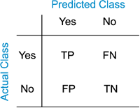
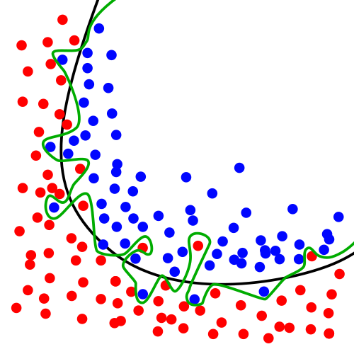
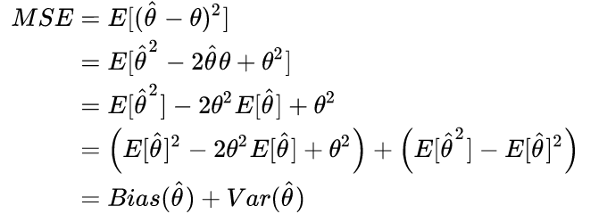
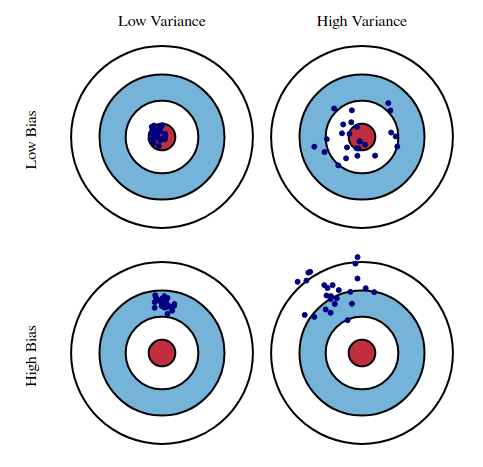
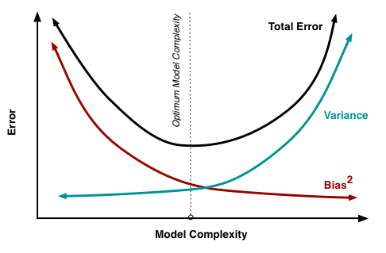

# 机器学习基础

作为一个多学科交叉的融合学科，机器学习涉及到包括计算机、矩阵分析、概率统计、优化理论等在内的多门学科知识，它让计算机能够`在没有被显示编程的情况下拥有学习的能力`。机器学习算法能够自动地从数据中发现内在的知识和规律，并根据这些规律对未知数据可能产生的结论进行推测。几乎所有由计算机完成的`智能型`任务背后都是机器学习算法的功劳。

## 1. 学习算法

&emsp;&emsp;根据书中的解释，机器学习中`学习`的定义是“对某类任务T和性能度量P，一个计算机程序被认为可以从经验E中学习是指，通过经验E改进后，它在任务T上由性能度量P衡量的性能有所提升"。例如在[数值计算](../数学基础/数值计算.md)的求解实例中，任务T是指选取$f(x)$的合适参数，以使$f(x)$与$y$尽可能的接近；`尽可能的接近`是性能度量P的描述，形式化的表示为估计值与真实值之间的平方损失；而使用的数据集和学习算法类型为经验E。

&emsp;&emsp;关于任务T，性能度量P和经验E有以下需要了解的地方

### 任务T

&emsp;&emsp;机器学习的任务通常定义为让计算机学会如何处理样本，样本即为我们通常所说的`特征(feature)`，基本的机器学习任务如下：

+ 分类：最常见的机器学习任务之一，根据样本特征判断样本类别，即输入特征输出有限的离散值。例如，根据天气情况判断是否会下雨，根据图片判断其中物体的类别。

+ 回归：另一种常见的机器学习任务，根据输入样本特征输出一个连续的属性值。例如，根据天气情况预测明天的温度，根据特征情况预测房价等。

+ 聚类：将样本点根据特征划分为不同的类簇。例如，根据客户的属性特征将客户自动的聚成不同类别。

+ 密度估计：根据所给的样本点，估计样本的分布情况。

除此之外，机器学习能够做的一些具体的任务包括转录、机器翻译、结构化输出、异常检测等。

### 性能度量P

&emsp;&emsp;为了评估机器学习的优劣，需要对算法的输出结果进行定量的衡量分析，这就需要一些合适的性能度量指标。

+ 对于分类任务而言，根据真实结果和预测结果的关系有如下几种情况，分类任务的许多指标也都是由这几种情况得来。

  

  + 准确率(Accuracy)：$acc = \frac{TP+TN}{TP+TN+FP+FN}$

  + 错误率(Errorrate)：$err = 1-acc$

  + 精度(Precision)：$P = \frac{TP}{TP+FP}$

  + 召回率(Recall)：$R = \frac{TP}{TP+FN}$

  + F1值：$F_1 = \frac{2PR}{P+R}$

+ 对于回归任务，通常使用距离误差来进行度量

+ 对于聚类任务使用包括紧密性，间隔性等，这可以衡量聚类团簇的性能。

&emsp;&emsp;需要注意的是，性能指标通常要根据任务情况来进行选取，对于部分简单的任务而言，可以比较容易的选择性能度量指标，而对很多的复杂任务而言，选取合适的性能指标需要将很多因素综合考虑。另外，为了更准确有效地衡量机器学习算法的能力，通常会将数据划分出来一部分作为测试集，使用模型在这部分数据的输出结果衡量其性能。

### 经验E

+ 监督学习算法(Supervised Learning)：训练集的数据中包含样本特征和标签值，常见的分类和回归算法都是有监督的学习算法。

+ 无监督学习算法(Unsupervised Learning)：训练集的数据中只包含样本特征，算法需要从中学习特征中隐藏的结构化特征，聚类、密度估计等都是无监督的学习算法。

## 2. 容量、过拟合和欠拟合

+ 泛化能力(Generalization)：模型在先前未知数据上的表现是否良好的能力。通常情况下，机器学习的模型是要作用在先前未知的数据上的，具有良好泛化能力的算法才是符合需求的。

+ 训练误差：训练误差是模型训练的时候在训练集上的误差。

+ 测试误差（泛化误差）：模型在测试集（先前未知数据）上的误差。

+ 欠拟合(Underfitting)：模型在训练集上的误差较大，这通常是由于训练不充分或者模型不合适导致。

+ 过拟合(Overfitting)：模型在训练集和测试集上的误差差距过大，通常由于模型过分拟合了训练集中的随机噪音，导致泛化能力较差。一个过拟合的示例如下图所示。

+ 独立同分布假设(i.i.d assumption)：使用机器学习算法训练的一条基本假设，训练和测试集中的样本均是`独立地`从一个`数据生成分布`中采样得到，将这个数据分布记为$p_{data}$

+ 正则化：正则化是降低泛化误差，减小过拟合的一个有效手段，包括在损失函数中添加正则项、对数据添加噪声以及神经网络中最常用的dropout都属于正则化方法。

## 3. 超参数和验证集

+ 超参数：用来控制学习算法的参数而非学习算法本身学出来的参数。例如，进行曲线的回归拟合时，曲线的次数就是一个超参数；在构建模型对一些参数的分布假设也是超参数。

+ 验证集：通常在需要选取超参数数时，将训练接在划分为训练和验证集两部分，使用新的训练集训练模型，验证集用来进行测试和调整超参。

+ k折交叉验证：将数据集均分为不相交的k份，每次选取其中的一份作为测试集，其他的为训练集，训练误差为k次的平均误差

## 4. 估计、偏差和方差

### 基本概念

+ 点估计：在已知一些独立同分布样本点的情况下去预测一些参数的`单个最佳`值，例如回归问题中的预测权重，通常将参数$\boldsymbol{\theta}$的点估计记为$\boldsymbol{\hat{\theta}}$。

+ 偏差(bias)：$bias(\boldsymbol{\hat{\theta}}) = E(\boldsymbol{\hat{\theta}}) - \boldsymbol{\theta}$，表示估计量$\boldsymbol{\hat{\theta}}$的期望与真实值之间的差距。bias=0的估计被称为无偏估计，当样本容量增大时，bias的极限为0时的估计被称为渐进无偏估计。

+ 方差(variance)：一个估计量$\boldsymbol{\hat{\theta}}$变化程度的多少。

### 误差与偏差和方差的关系

&emsp;&emsp;bias和variance是一个估计量的两个不同误差来源，通常情况下可以使用均方误差(Mean Squared Error, MSE)来表示估计的好坏，有 
<!---->
$$
\begin{align}
MSE & = E[ (\hat{ \boldsymbol{\theta}} - \boldsymbol{\theta})^2 ] \nonumber \\
 & = E[ \boldsymbol{\hat{\theta}}^2 - 2\boldsymbol{\hat{\theta}\theta} + \boldsymbol{\theta}^2 ] \nonumber \\ 
 & = E[ \hat{\boldsymbol{\theta}}^2 ] - 2 \boldsymbol{\theta}^2 E[ \hat{\boldsymbol{\theta}} ] + \boldsymbol{\theta}^2 \nonumber \\ 
 & = \left( E[ \hat{\boldsymbol{\theta}} ]^2 - 2 \boldsymbol{\theta}^2 E[ \hat{\boldsymbol{\theta}} ] + \boldsymbol{\theta}^2 \right) + \left( E[ \hat{\boldsymbol{\theta}}^2 ] - E[ \hat{\boldsymbol{\theta}} ]^2 \right) \nonumber \\
 & = Bias(\hat{\boldsymbol{\theta}}) + Var(\hat{\boldsymbol{\theta}}) \nonumber \\
\end{align}
$$

> 实际上，除了包含bias和bar之外，MSE还应当包含噪声项，但噪声通常是不可控的随机因素，因此一般不考虑。

&emsp;&emsp;bias和variance的形象化描述可以用如下的图表示（图片引自[BiasVariance](http://scott.fortmann-roe.com/docs/BiasVariance.html)）: 

而bias和variance与模型复杂度之间的关系如下图，随着模型复杂度的提高，模型对训练数据的拟合效果提升，bias降低，而variance增大，算法的训练目标就是寻找一个平衡variance和bias的点，最小化总的error 

## 5. 最大似然估计

&emsp;&emsp;最大似然估计(Maximum Likelihood Estimation, MLE)是一种最为常见的估计准则。用一句话可以概括为在已知分布产生的一些样本而未知分布具体参数的情况下根据样本值推断最有可能产生样本的参数值。将数据的`真实分布`记为$p_{data}(x)$为了使用MLE，需要先假设样本`服从`某一簇有参数确定的分布$p_{model}(x;\theta)$，现在的目标就是使用估计的$p_{model}$来拟合真实的$p_{data}$，MLE产生的参数估计值被定义为：

$$\theta_{ML} = \mathop{\arg\max}_{\theta} \prod_i p_{model}(x^i;\theta)$$

通常为了计算方便，会对MLE加上log，将乘积转化为求和然后将求和变为期望：

$$\theta_{ML} = \mathop{\arg\max}_{\theta} E[\log p_{model}(x;\theta)]$$

最大似然估计的一种解释是使$p_{model}$与$p_{data}$之间的差异性尽可能的小，形式化的描述为最小化两者的KL散度。

&emsp;&emsp;此外，MLE也很容易转化为条件概率的形式，如下所示：
$$\theta\_{ML} = \mathop{\arg\max}_{\theta} E[\log p_{model}(y;x,\theta)]$$，
上式是许多监督学习算法的基础假设。

## 6. 贝叶斯估计

&emsp;&emsp;最大似然估计属于典型的频率学派统计方法，它假设数据是由单一的最优参数值生成，并在此基础上对参数进行估计；而另一种方法是考虑到所有的的参数值以及这些参数的先验概率分布，通过贝叶斯准则来对估计参数的后验分布情况，用公式表示如下：

$$p(\theta|x^{(1)},x^{(2)}...,x^{(m)}) = \frac{p(x^{(1)},x^{(2)}...,x^{(m)|\theta})p(\theta)}{p(x^{(1)},x^{(2)}...,x^{(m)})}$$

贝叶斯估计假设已知的是参数的先验分布情况和模型的类簇，之后利用数据集的样本点根据贝叶斯准则来对参数的分布情况进行修正，它得到的结果`不是一个单一的参数值`，而是根据参数先验分布和真实样本得到的`修正过后的参数分布`，即参数的`后验分布`，根据贝叶斯估计，在已知m个样本后，估计第m+1的样本分布的公式如下：

$$p(x^{(m+1)}|x^{(1)},x^{(2)}...,x^{(m)}) = \int p(x^{(m+1)}|\theta)p(\theta|x^{(1)},x^{(2)}...,x^{(m)}) d\theta$$

可以看到，不同于频率学派单点估计的方法，贝叶斯估计在对未知数据预测时，将所有的参数分布都进行了考虑，同时按照参数的概率密度情况进行加权。

### 最大后验估计

&emsp;&emsp;完整的贝叶斯估计需要使用参数的完整分布进行预测，然而对绝大多数的机器学习任务而言，这将会导致十分繁重的计算因而是不可取的，因此通常利用最大后验估计(Maximum A Posteriori, MAP)来选取一个计算可行的单点估计参数作为贝叶斯估计的近似解，公式如下：

$$\theta_{MAP} = \mathop{\arg\max}_{\theta} \log p(\theta|x) =  \mathop{\arg\max}_{\theta} \log p(x|\theta) + \log p(\theta) $$

可以看到MAP的估计实际上就是对数似然加上参数的先验分布。实际上，在参数服从高斯分布的情况下，上式的右边就对应着L2正则项；在Laplace的情况下，对应着L1的正则项；在均匀分布的情况下则为0，等价于MLE。

## 7. 传统机器学习算法

### 构建机器学习算法的要素

&emsp;&emsp;构建一个完整的机器学习算法需要以下几个部分。

+ 数据集：数据是机器学习算法处理的目标，而在构建算法时首先也需要考虑数据特点。

+ 模型：在构建机器学习算法时首先需要根据问题和数据特点选取合适的模型，有些模型可能能够很好的描述问题，但在计算上是不可行的；而有些模型可能得出次优的结果，但是是可以接受的。

+ 损失函数：损失函数是模型在训练时的标准度量，机器学习算法的目标也都是去最小化损失函数。

+ 优化算法：在定义了损失函数后求解这个目标的方法，典型的方法即为梯度下降法。

### 常用算法

+ 有监督算法：[支持向量机](https://en.wikipedia.org/wiki/Support_vector_machine)，[逻辑回归](https://en.wikipedia.org/wiki/Logistic_regression)，[决策树](https://en.wikipedia.org/wiki/Decision_tree)等
+ 无监督算法: [主成分分析](https://en.wikipedia.org/wiki/Principal_component_analysis)，[k均值聚类](https://en.wikipedia.org/wiki/K-means_clustering),[EM算法](https://en.wikipedia.org/wiki/Expectation%E2%80%93maximization_algorithm)等
