# 深度前馈网络

&emsp;&emsp;深度前馈网络（deep feedforward network），也叫做前馈神经网络（feedforward neural network）或者多层感知机（multilayer perceptron, MLP）。前馈网络是深度学习的基础，同时在工业应用中也有很重要的作用。

### 基本概念

+ 网络（network）：神经网络被称为网络是指它们通常由许多函数复合而成。神经网络模型与一个有向无环图关联，这个图描述了函数如何复合。例如：$f(\boldsymbol{x})=f^{(3)}(f^{(2)}(f^{(1)}(\boldsymbol{x})))$这种情况下，$f^1$称为网络的第一层，$f^2$称为网络的第二层，以此类推，链的长度就称为网络的深度，深度学习这个术语也由此而来。

+ 输出层（output layer）：前馈网络的最后一层称为输出层，对于输出层，学习算法知道输出层应该做什么：使得训练数据的输出接近真实值。

+ 隐藏层（hidden layer）：对于其他网络层，学习算法不能直接指明这些层应该怎么做，因此这些层被称为隐藏层，宽度是指隐藏层的维度。

+ 前馈（feedforward）：前馈模型中输入信息$x$流经定义神经网络的每一层隐藏单元，到输出$y$，模型的输出到模型之间没有反馈（feedback）连接。

+ 循环神经网络（recurrent neural network）:前馈神经网络包含了反馈连接时，这样的神经网络结构称为循环神经网络。

### 理解方法

&emsp;&emsp; 理解前馈网络的一种方式是从线性模型开始，并且考虑如何克服它的局限性。为了扩展线性模型来表示输入$x$的非线性函数，我们可以先对$x$进行一个非线性变换$\phi(\boldsymbol{x})$，或者使用前面提到的核函数。可以认为$\phi$ 提供了一组描述$\boldsymbol{x}$的特征或$\boldsymbol{x}$的新的表示。

* $\phi$的一种选择是通用的$\phi$，如RBF（Radial Basis Function）核，通用$\phi$对于测试集泛化往往效果不佳。

* 另一种选择是手动设计$\phi$，这种方法需要对某个领域的专业知识。并且不同领域之间很难迁移。

* 深度学习的策略是学习$\phi$，这种方法能够结合前两者优点。

### 本文结构

本文先讲解一个前馈网络的简单例子，然后讨论前馈网络中的设计决策，包括：

+ 选择优化模型

+ 选择代价函数

+ 确定输出单元

+ 隐藏层激活函数的设计

+ 网络结构的设计

+ 反向传播（back propagation）算法

## 1. 学习XOR

&emsp;&emsp;XOR函数是两个二进制值$x_1$和$x_2$的运算，当$x_1$和$x_2$中有且仅有一个为1时，XOR函数值为1，否则为0。在这个例子中，我们不关心统计泛化，只需要网络在这四个点上$\mathbb{X}=\\{[0, 0]^T,[0, 1]^T,[1, 0]^T,[1, 1]^T \\}$表现正确。

&emsp;&emsp;把这个问题当成回归问题，并且使用均方误差损失函数，此时，评估训练集上表现的MSE损失函数为：

$$J(\boldsymbol{\theta})= \frac{1}{2}\sum_{\boldsymbol{x}\in\mathbb{X}}(f^*(\boldsymbol{x})-f(\boldsymbol{x};\boldsymbol{\theta}))^2$$

&emsp;&emsp;假设我们选择的模型被定义成：

$$f(\boldsymbol{x},\boldsymbol{w},b)=\boldsymbol{x}^T\boldsymbol{w}+b$$

&emsp;&emsp;通过解$J(\boldsymbol{\theta})$关于$\boldsymbol{w}$和$b$最小化的正规方程可以得到解$w=0$以及$b=\frac{1}{2}$。说明线性模型仅仅在任意一点都输出0.5。直接使用原始的线性模型不能解决XOR问题。为了解决这个问题，我们可以用一个模型学习一个不同的特征空间，在这个特征空间上，线性模型能够表示这个解。

&emsp;&emsp;这里引入一个非常简单的前馈网络，它有一层隐藏层，并且隐藏层中包含两个单元。如下图所示：

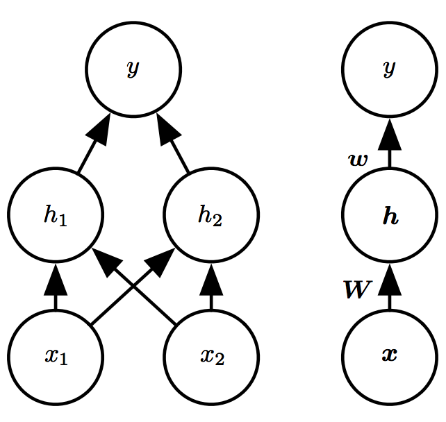

&emsp;&emsp;这个前馈网络通过一个函数$f^{(1)}(\boldsymbol{x}; \boldsymbol{W}, \boldsymbol{c})$计算得到隐藏单元的向量$\boldsymbol{h}$，这个向量被用作网络第二层的输入，而第二层是这个网络的输出层，输出层是一个线性回归模型。输出层作用在$\boldsymbol{h}$而不是$\boldsymbol{x}$。网络包含链接到一起的两个函数：$\boldsymbol{h}=f^{(1)}(\boldsymbol{x}; \boldsymbol{W}, \boldsymbol{c})$和$y=f^{(2)}(\boldsymbol{h}; \boldsymbol{w}, \boldsymbol{b})$，完整的模型是：$f(\boldsymbol{x};\boldsymbol{W},\boldsymbol{c},\boldsymbol{w},b)=f^{(2)}(f^{(1)}(x))$。

&emsp;&emsp;考虑$f^{(1)}$，如果$f^{(1)}$也是线性的，那么整个前馈网络作为一个整体仍然是线性的。显然我们必须用非线性函数来描述这些特征，大多数神经网络通过仿射变换加一个被称为激活函数的固定非线性函数来实现这个目标，其中的放射变换由学得的参数控制，定义$\boldsymbol{h}=g(\boldsymbol{W}^T\boldsymbol{x}+\boldsymbol{c})$，其中$\boldsymbol{W}$是线性变换的权重矩阵，$\boldsymbol{c}$是偏置，注意这里的偏置是一个向量，由每一个隐藏单元的偏置构成。激活函数通常对于每个隐藏单元起作用。现代神经网络默认推荐使用整流线性单元（rectified linear unit）作为激活函数，其形式为$g(z)=max\{0,z\}$。因此，我们整个前馈网络模型如下：

$$f(\boldsymbol{x};\boldsymbol{W},\boldsymbol{c},\boldsymbol{w},b)=\boldsymbol{w}^Tmax\{0, \boldsymbol{W}^T\boldsymbol{x}+\boldsymbol{c}\}+b$$

&emsp;&emsp;这里直接给出XOR前馈网络的一个解。令
$$
\boldsymbol{W} = \left[ \begin{matrix}1 & 1 \\ 1 & 1 \end{matrix} \right],
\boldsymbol{c} = \left[ \begin{matrix} 0  \\ -1 \end{matrix} \right],
\boldsymbol{w} = \left[ \begin{matrix} 1  \\ -2 \end{matrix} \right],
\boldsymbol{b}=0
$$

通过整流线性变换，原来的样本空间被改变，此时可以用线性模型样本正确分类了。具体如下图所示：

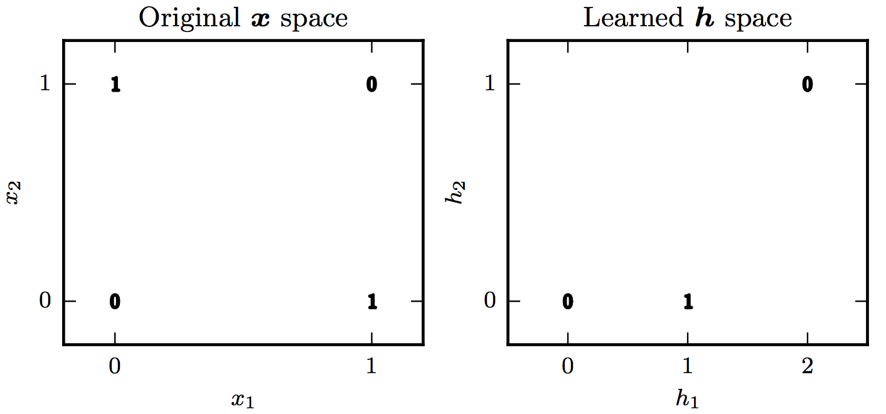

&emsp;&emsp;下面是分别使用线性回归和带有一层隐藏层的模型来学习XOR的示例，其中神经网络中隐藏层使用的激活函数是整流线型单元，代码分析和结果如下： 

+ 定义训练样本X和Y、定义输入x，输出y，定义权重w和偏置b，定义线性回归输出out，定义损失函数为均方差损失函数loss，并且使用Adam算法的Optimizer。

```python
import tensorflow as tf
import numpy as np

X = np.array([[0, 0], [0, 1], [1, 0], [1, 1]])
Y = np.array([[0], [1], [1], [0]])

x = tf.placeholder(tf.float32, [None, 2])
y = tf.placeholder(tf.float32, [None, 1])

w = tf.Variable(tf.random_normal([2, 1]))
b = tf.Variable(tf.random_normal([1]))

out = tf.matmul(x, w) + b
loss = tf.reduce_mean(tf.square(out - y))

train = tf.train.AdamOptimizer(0.01).minimize(loss)
```

+ 线性回归的训练过程

```python
with tf.Session() as sess:
    sess.run(tf.global_variables_initializer())
    for i in range(1000):
        for j in range(4):
            sess.run(train, feed_dict={x: np.expand_dims(X[j], 0), y: np.expand_dims(Y[j], 0)})
        loss_ = sess.run(loss, feed_dict={x: X, y: Y})
        print("step: %d, loss: %.3f"%(i, loss_))
    print("X: %r"%X)
    print("pred: %r"%sess.run(out, feed_dict={x: X}))
```

+ 训练结果


+ 定义单隐藏层前馈网络模型的训练样本X和Y、定义输入x，输出y，隐藏层包括两个单元，参数分别定义为w1_1，b1_1和w1_2，b1_2，以及隐藏层的整流线性激活函数h1和h2，定义输出层参数w2，b2，定义深度前馈网络模型输出out，定义损失函数为均方差损失函数loss，并且使用Adam算法的Optimizer。

```python
import tensorflow as tf
import numpy as np

X = np.array([[0, 0], [0, 1], [1, 0], [1, 1]])
Y = np.array([[0], [1], [1], [0]])

x = tf.placeholder(tf.float32, [None, 2])
y = tf.placeholder(tf.float32, [None, 1])

w1_1 = tf.Variable(tf.random_normal([2, 1]))
w1_2 = tf.Variable(tf.random_normal([2, 1]))
w2 = tf.Variable(tf.random_normal([2, 1]))

b1_1 = tf.constant(0.1, shape=[1])
b1_2 = tf.constant(0.1, shape=[1])
b2 = tf.constant(0.1, shape=[1])

h1 = tf.nn.relu(tf.matmul(x, w1_1) + b1_1)
h2 = tf.nn.relu(tf.matmul(x, w1_2) + b1_2)

hidden = tf.concat([h1, h2], 1)
out = tf.matmul(hidden, w2) + b2

loss = tf.reduce_mean(tf.square(out - y))

train = tf.train.AdamOptimizer(0.01).minimize(loss)
```

+ 深度前馈网络的训练过程

```python
with tf.Session() as sess:
    sess.run(tf.global_variables_initializer())
    for i in range(1000):
        for j in range(4):
            sess.run(train, feed_dict={x: np.expand_dims(X[j], 0), y: np.expand_dims(Y[j], 0)})
        loss_ = sess.run(loss, feed_dict={x: X, y: Y})
        print("step: %d, loss: %.3f"%(i, loss_))
    print("X: %r"%X)
    print("pred: %r"%sess.run(out, feed_dict={x: X}))
```


## 2. 基于梯度的学习

&emsp;&emsp;神经网络中的非线性导致它的大部分代价函数变得非凸，对于非凸的损失函数，梯度下降算法不能保证收敛到全局最优，因此神经网络模型中的参数初始化是非常重要的，通常会将所有的权重初始化为一个较小的随机数，并且将偏置初始化为0或者较小的正值。针对神经网络的梯度算法将在后续的学习班中详细介绍。同其他机器学习算法一样，基于梯度的学习方法，需要设计代价函数，选择模型输出的表示方法。这里介绍神经网络中关于它们的一些设计方法。

### 2.1 损失函数

&emsp;&emsp;同其他机器学习模型一样，大多数情况下，神经网络的参数模型定义一个分布$p(\boldsymbol{y} \| \boldsymbol{x};\boldsymbol{\theta})$，并且使用最大似然原理，用训练数据和模型预测间的交叉熵作为损失函数。

&emsp;&emsp;有时候我们不需要预测$\boldsymbol{y}$的完整概率分布，而是仅仅预测在给定$\boldsymbol{x}$的条件下$\boldsymbol{y}$的统计量。这个时候我们会使用一些专门的损失函数来进行模型的评估。

#### 2.1.1 使用极大似然学习条件分布

&emsp;&emsp;大多数现代神经网络使用极大似然原理，也就是说模型的损失函数和训练数据和模型分布间的交叉熵等价。它表示为：

<!-- 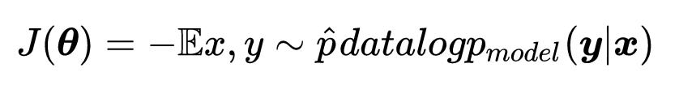 -->
$$
J(\boldsymbol{\theta})= -\mathbb{E}_{x,y\sim\hat{p}_{data}}\log p_{model}(\boldsymbol{y}|\boldsymbol{x})
$$

&emsp;&emsp;损失函数的具体形式取决于模型$\log p_{model}(\boldsymbol{y} \| \boldsymbol{x})$，例如如果$p_{model}(\boldsymbol{y} \| \boldsymbol{x})=\mathcal{N}(\boldsymbol{y};f(\boldsymbol{x};\boldsymbol{\theta},\boldsymbol{I}))$，那么就得到了均方误差代价函数：

<!--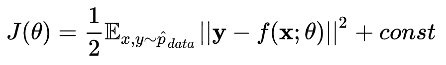 -->
$$J(\boldsymbol{\theta})= \frac{1}{2}\mathbb{E}_{x,y\sim\hat{p}_{data}}||\boldsymbol{y}-f(\boldsymbol{x};\boldsymbol{\theta})||^2+const$$

&emsp;&emsp;这里讲一下使用极大似然原理导出损失函数减轻了为每个模型设计损失函数的负担，选择了模型$p(\boldsymbol{y} \|  \boldsymbol{x})$就明确了损失函数$logp(\boldsymbol{y} \| \boldsymbol{x})$

&emsp;&emsp;由于神经网络的特殊结构，导致神经网络必须注意的是损失函数的梯度必须有足够大的预测性，这样才能很好的指导算法的学习。很多输出单元都会包含一个指数函数，当变量取绝对值非常大的负值时函数会变得饱和（函数变得很“平”），函数梯度变得很小，而负的对数似然能够抵消输出单元中的指数效果。

&emsp;&emsp;对于实现最大似然估计的交叉熵损失函数通常需要使用正则化技术来避免过拟合的情况，这将在后续的学习班中介绍。

#### 2.1.2 学习条件统计量

&emsp;&emsp;我们有时只需要学习给定$\boldsymbol{x}$时的$\boldsymbol{y}$的某个条件统计量，不需要学习一个完整的概率分布$p(\boldsymbol(y) \| \boldsymbol{x};\boldsymbol{\theta})$。这是需要使用变分法（calculus of variations），通过学习到一个函数，这个函数能够计算给定$\boldsymbol{x}$时$\boldsymbol{y}$的均值和中位数，具体细节这将在后续的学习班中介绍。目前我们给出学习给定$\boldsymbol{x}$时的$\boldsymbol{y}$均值和中位数的优化问题：

&emsp;&emsp;预测$\boldsymbol{y}$的均值通过优化问题

<!--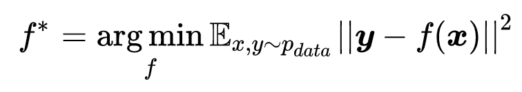-->
$$f^*=\mathop{\arg\min}_{f} \mathbb{E}_{x,y\sim{p_{data}}}||\boldsymbol{y}-f(\boldsymbol{x})||^2$$
从而得到
<!--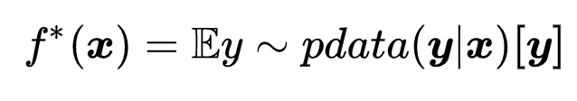-->
$$f^*(\boldsymbol{x})=\mathbb{E}_{y\sim{p_{data(\boldsymbol{y}|\boldsymbol{x})}}}\boldsymbol{[y]}$$
只要这个函数属于我们所要优化的函数簇，那么我们可以得到一个对于每个$\boldsymbol{x}$预测$\boldsymbol{y}$均值的函数。

&emsp;&emsp;不同的损失函数可以给出不同的统计量，为了预测$\boldsymbol{y}$的中位数，我们通过优化问题

<!--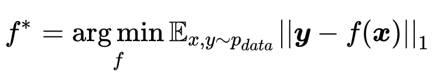-->
$$f^*=\mathop{\arg\min}_{f} \mathbb{E}_{x,y\sim{p_{data}}}||\boldsymbol{y}-f(\boldsymbol{x})||_1$$

得到一个函数，如果这个函数属于我们所需优化的函数簇，那么这个函数可以对每个$\boldsymbol{x}$预测$\boldsymbol{y}$的中位数。这个损失函数其实就是平均绝对误差（mean absolute error）

&emsp;&emsp;需要提出的是，均方误差和平均绝对误差在使用基于梯度的优化方法时，回因为饱和的问题导致效果不好。因此即使我们不需要预测整个$p(\boldsymbol{y} \| \boldsymbol{x})$，也倾向于使用交叉熵损失函数。

### 2.2 输出单元

&emsp;&emsp;从前文可知，通过极大似然的交叉熵损失函数，与我们选择的输出模型相关。本节讨论输出单元的选择，我们假定本节输出单元对前馈网络提供的一组定义为$\boldsymbol{h}=f(\boldsymbol{x},\boldsymbol{\theta})$的隐藏特征进行变换来完成整个网络的任务。

#### 2.2.1 用于高斯输出分布的线性单元

&emsp;&emsp;线性输出层基于仿射变换，仿射变换的单元被称为线性单元。给定特征$\boldsymbol{h}$，线性输出层产生输出向量$\boldsymbol{\hat{y}}=\boldsymbol{W}^T\boldsymbol{h}+\boldsymbol{b}$，线性输出层常被用来产生条件高斯分布均值：

$$p(\boldsymbol{y}|\boldsymbol{x})=\mathcal{N}(\boldsymbol{y};\boldsymbol{\hat{y}},\boldsymbol{I}))$$

最大化其最大似然等价于最小化均方误差。线性模型不会饱和，因此适合采用基于梯度的优化算法，也可以使用其他多种优化算法。

#### 2.2.2 用于Bernoulli输出分布的sigmoid单元

&emsp;&emsp;对于二分类问题，极大似然方法是定义$y$在条件$\boldsymbol{x}$下的Bernoulli分布。Bernoulli分布仅需要预测单个参数$P(y=1 \| \boldsymbol{x})$，并且这个参数处于区间[0, 1]    中。

&emsp;&emsp;如果我们使用线性单元，则需要限定它是一个有效的概率值：

$$P(y=1|\boldsymbol{x})=max\{0, min\{1, \boldsymbol{w}^T\boldsymbol{h}+b\}\}$$

这满足概率要求，但是使用梯度下降算法无法高效训练这个模型，因为当$\boldsymbol{w}^T\boldsymbol{h}+b$处于单位区间外，模型梯度都将为0，梯度为0则使得算法不能再继续学习参数。我们需要使用一种方法使得无论模型合适给出错误答案，都能有一个比较大的梯度。这就是使用sigmoid单元的原因，sigmoid单元定义如下：

$$\hat{y}=\sigma(\boldsymbol{w}^T\boldsymbol{h}+b)$$

我们分析使用sigmoid单元的极大似然交叉熵损失函数，首先忽略对于$\boldsymbol{x}$的依赖性，只讨论如何用$z$的值来定义$y$的概率分布。sigmoid可以构造一个非归一化（和不为1）的概率分布$\tilde{P}(y)$。通过除以一个合适的常数，可以得到一个有效的概率分布。假定非归一化的对数概率对$y$和$z$是线性的，可以对它取指数来得到非归一化的概率。然后进行归一化，可以发现它服从Bernoulli分布，该分布收到$z$的sigmoid变换控制。步骤如下：

$$log\tilde{P}(y)=yz,$$

$$\tilde{P}(y)=exp(yz),$$

归一化：

$$P(y)=\frac{exp(yz)}{\sum_{y^{'}=0}^{1}exp(y^{'}z)}$$

$$P(y)=\sigma((2y-1)z)$$

定义这种二值分布的变量$z$被称为分对数(logit)。

&emsp;&emsp;由上文可知，基于最大似然交叉熵的损失函数为$-logP(y \| \boldsymbol{x})$，上文中说明了损失函数中的对数抵消了sigmoid中的指数，使得梯度不会饱和。基于极大似然交叉熵的损失函数如下所示：

$$J(\boldsymbol{\theta})=-logP(y|\boldsymbol{x})=-log\sigma((2y-1)z)=\zeta((1-2y)z)$$

推导使用到了书中3.10节的一些性质，有兴趣可以自己推导一遍。$-log\sigma((2y-1)z)$和Andrew Ng老师在coursera上介绍逻辑回归时给出的损失函数是等价的。将损失函数写成softplus函数的形式，是为了结合softplus函数的性质，来看一下这个损失函数的饱和情况，通过观察可以看到仅在$(1-2y)z$取绝对值非常大的负值时，才会饱和，而此时模型已经学到了正确参数。而在模型尚未学习到正确参数，损失函数的梯度是不会饱和的。如果我们使用其他损失函数，例如均方差损失函数，损失函数将达到饱和，此时基于梯度的学习算法将不能有效学习正确参数。

#### 2.2.3 用于Multinoulli输出分布的softmax单元

&emsp;&emsp;当我们进行n分类时，我们可以使用softmax函数，softmax函数用于表示$n$个不同分类上的概率分布，用向量$\hat{\boldsymbol{y}}$表示，其中，每个元素$\hat{y}_i=P(y=i \|    \boldsymbol{x})$，要求每个$\hat{y}_i$在0到1之间，并且所有$\hat{y}_i$之和为1。类似于上文讲的二分类，多分类首先用线性层预测了未归一化的概率：

$$\boldsymbol{z}=\boldsymbol{W}^T\boldsymbol{h}+\boldsymbol{b}$$

其中$z_i=\hat{P}(y=i \| \boldsymbol{x})$。softmax函数对其指数化并且归一化来获得满足条件的$\hat{\boldsymbol{y}}$。softmax函数形式为：

<!--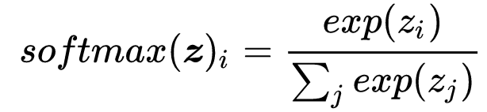-->
$$softmax(\boldsymbol{z})_i=\frac{exp(z_i)}{\sum_{j}exp(z_j)}$$
使用最大化对数似然来训练softmax输出目标$y$，得到如下损失函数：

<!--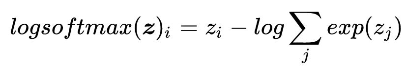-->
$$\log softmax(\boldsymbol{z})_i=z_i-\log\sum_{j}exp(z_j)$$
这个损失函数不会出现饱和的情况，对于错误的参数总能得到比较大的梯度，需要注意的是，如果不适用对数似然的损失函数，那么由于指数项的存在将导致饱和问题而不能达到好的训练效果。

## 3 隐藏单元

### 3.1 整流线性单元及其扩展

&emsp;&emsp;整流线性单元的激活函数如下：

$$g(z)=max(0,z)$$

&emsp;&emsp;整流线性单元的特点是当它处于激活状态时，它们的梯度大于0并且是一致的，一阶导数处处为1，这对于学习算法来说是很有用的。整流线性单元通常作用于仿射变换之上：

$$\boldsymbol{h}=g(\boldsymbol{W}^T\boldsymbol{x}+\boldsymbol{b})$$

初始化的仿射变换参数的建议是将$b$的所有元素设置成一个较小的正值，这样整流线性单元在初始时就对训练集中的大多数输入处于激活状态，并且允许导数通过。

&emsp;&emsp;整流线性单元的一个缺陷是未激活状态不能带来基于梯度学习的效果。因此许多整流线性单元的扩展设计了不同的方法避免这种情况。当$z_i=0$时使用一个非零的斜率$\alpha_i$，表示为$g(\boldsymbol{z},\boldsymbol{\alpha})_i=max(0,z_i)+\alpha_imin(0,z_i)$下面是三种基于这种设计方法的激活函数：

+ 绝对值整流（absolute value rectification）：通过固定$\alpha_i=-1$来得到$g(z)= \| z \|$

+ 渗漏整流线性单元（Leaky ReLU）：固定$\alpha_i$为一个类似0.01的小值

+ 参数化整流线性单元（parametric ReLU）或者ReLU将$\alpha_i$也作为一个要学习的参数

&emsp;&emsp;maxout单元（maxout unit）进一步扩展了整流线性单元，maxout单元将z划分为每组具有$k$个值的组，表示如下:

<!--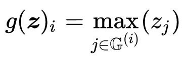-->
$$g(\boldsymbol{z})_i=\max\limits_{j\in\mathbb{G}^{(i)}}(z_j)$$

其中$\mathbb{G}^{(i)}$是组$i$的输入索引集合$\{(i-1)k+1,...,ik\}$，maxout可以学习$k$段的分段线性凸函数。当$k$足够大时，maxout可以以任意精度来近似任何凸函数。由于maxout相比普通整流线性单元增加了$k$组，因此参数增加了$k$倍，所以训练maxout需要更多的正则化或者更多训练样本来提高模型的泛化能力。

### 3.2 logistic sigmoid与双曲正切函数

&emsp;&emsp;对于隐藏单元，logistic sigmoid函数只有在输入接近0的时候它们的梯度才比较大，因此不鼓励将它们作为前馈网络中的隐藏层，对于上文提到的输出层，对数似然损失函数抵消了sigmoid的饱和性，因此可以用在基于梯度学习的输出单元中。

&emsp;&emsp;双曲正切激活函数$g(z)=tanh(z)$通常比sigmoid函数表现要好，它和sigmoid激活函数关系密切：$tanh(z)=2\sigma(2z)-1$。因此需要用sigmoid函数作为隐藏层激活函数时，可以考虑使用双曲正切函数代替。双曲正切函数在0附近与单位函数类似，因此使用双曲正切函数作为激活函数类似于学习一个线性模型，因此在输入处于0附近时，使用tanh网络更加容易进行学习。

&emsp;&emsp;相比前馈网络的隐藏层，sigmoid激活函数在循环网络等一些额外要求不能使用分段激活函数的场景中更实用。

## 4 架构设计

&emsp;&emsp;神经网络的架构（architecture）指网络的整体架构：神经网络需要多少单元以及单元之间的连接方式。大多数神经网络被组织成层的单元组，然后将这些层布置成链式结构，其中每一层是前一层的函数。在这种结构中，第一层表示如下：
$$\boldsymbol{h}^{(1)}=g^{(1)}(\boldsymbol{W}^{(1)T}\boldsymbol{x}+\boldsymbol{b}^{(1)})$$

那么第二层为：
$$\boldsymbol{h}^{(2)}=g^{(2)}(\boldsymbol{W}^{(2)T}\boldsymbol{h^{(1)}}+\boldsymbol{b}^{(2)})$$

&emsp;&emsp;在这个链式结构中，主要考虑的是网络的深度和每一层的宽度。通常来说更深的网络对每一层能够使用更少的单元数以及参数，并且泛化效果更好，但是它也更能难以训练

&emsp;&emsp;万能近似定理（universal approximation theorem）表明一个前馈神经网络如果具有线性输出层和至少一层具有任何一种
“挤压”性质的激活函数（如logistic sigmoid激活函数）的隐藏层，只要给与网络足够数量的隐藏单元，它可以以任意精度来近似任何从一个有限维空间到另一有限维空间的Borel可测函数，前馈网络的导数也可以任意精度来近似函数的导数。简单的说，定义在$\mathbb{R}^n$的有界闭集上的任意连续函数是Borel可测的，因此可以用神经网络来近似。神经网络也可以近似从任何有限维离散空间映射到另一个的函数。万能近似性质被证明对于比较广泛类别的激活函数都是适用的，其中包括整流线性单元。

&emsp;&emsp;万能近似定理说明了存在达到任意精度的这么一个神经网络，但是没有指出这个网络有多大。Barron提供了单层网络近似一大类函数所需大小的一些界，在最坏的情况下，隐藏单元的数量是指数数量。具有单层的前馈网络足以表达任何函数，但是单元数会多到无法实现，因此无法正确学习和泛化，在很多情况下，使用更深的模型能够减少表示期望函数所需的单元数量，并且可以减少泛化误差。增加网络的深度往往能够得到比增加宽度更加好的泛化能力。

&emsp;&emsp;架构设计的另外一种考虑是层与层之间的连接方式，后续的学习班会介绍在一些神经网络的专门设计。

## 5 反向传播算法及其例子

&emsp;&emsp;为了训练多层网络，我们可以使用一种新的学习算法--误差逆传播（error BackPropagation，简称BP算法），为了公式推导方便，这里使用sigmoid为激活函数的隐藏单元和输出单元，本推导参考了周志华老师的《机器学习》，下面我们来介绍BP算法。

&emsp;&emsp;给定训练集
<!--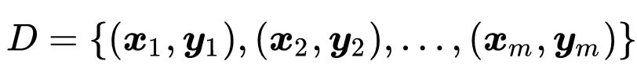-->
$$D=\{(\boldsymbol{x}_1,\boldsymbol{y}_1),(\boldsymbol{x}_2,\boldsymbol{y}_2),...,(\boldsymbol{x}_m,\boldsymbol{y}_m)\}$$
其中$\boldsymbol{x_k} \in \mathbb{R}^d,\boldsymbol{y_k} \in \mathbb{R}^l$，输入为$d$维，输出为$l$维。前馈神经网络结构为输入层有$d$个单元、输出层有$l$个单元、隐藏层具有$q$个单元，输出层第$j$个单元的阈值用$\theta_j$表示，隐藏层第$h$个单元的阈值用$\gamma_h$表示，输入层第$i$个单元与隐藏层第$h$个单元之间的连接权重为$v_{ih}$，隐藏层第$h$个单元与输出层第$j$个单元的连接权重为$w_{hj}$。隐藏层第$h$个单元接收到的输入为$\alpha_h=\sum_{i=1}^{d}v_{ih}x_i$，输出层第$j$个单元接收到的输入为$\beta_j=\sum_{h=1}^{q}w_{hj}b_h$，其中$b_h$为隐藏层第$h$个单元的输出。网络结构如下图所示：

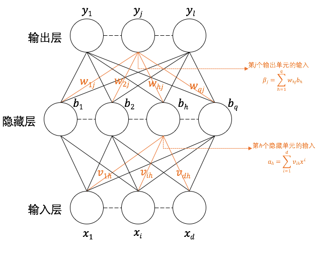

&emsp;&emsp;对训练数据$(\boldsymbol{x}_k,\boldsymbol{y}_k)$，假设神经网络的输出为$\hat{\boldsymbol{y}}_k=(\hat{y}_1^k,\hat{y}_2^k,...,\hat{y}_l^k)$，其中

$$\hat{y}_j^k=f(\beta_j-\theta{j})$$

那么对于样本$(\boldsymbol{x}_k,\boldsymbol{y}_k)$的均方差为

$$E_k=\frac{1}{2}\sum_{j=1}^{l}(\hat{y}_j^k-y_j^k)^2$$

BP算法基于梯度下降原理，用目标的负梯度方向对参数进行调整。由误差$E_k$，对于给定学习效率$\eta$，有：

$$\bigtriangleup{w_{hj}}=-\eta\frac{\partial{E_k}}{\partial{w_{hj}}}$$

由链式法则可知：
$$\frac{\partial{E_k}}{\partial{w_{hj}}}=\frac{\partial{E_k}}{\partial{\hat{y}_j^k}} \cdot \frac{\partial{\hat{y}_j^k}}{\partial{\beta_j}} \cdot \frac{\partial{\beta_j}}{\partial{w_{hj}}}$$
<!--[maxout](img/chain_rule.png)-->

由$\beta$的定义可得：

$$\frac{\partial{\beta_j}}{\partial{w_{hj}}}=b_h$$

而对于sigmoid函数：

$$\sigma^\prime(x)=\sigma(x)(1-\sigma(x))$$

那么根据上面$\hat{y}_j^k$和$E_k$的计算公式有：

$$
g_j = -\frac{\partial{E}_k}{\partial{\hat{y}_j^k}} \cdot \frac{\partial{\hat{y}_j^k}}{\partial{\beta_j}} = -(\hat{y}_j^k-y_j^k)f^\prime(\beta_j-\theta_j) = \hat{y}_j^k(1-\hat{y}_j^k)(y_j^k-\hat{y}_j^k)
$$

将上式和
$\frac{\partial{\beta_j}}{\partial{w_{hj}}}=b_h$带入

$$\hat{y}_j^k=f(\beta_j-\theta{j})$$


然后将结果代入

$$\bigtriangleup{w_{hj}}=-\eta\frac{\partial{E_k}}{\partial{w_{hj}}}$$

则得到$w_{hj}$的更新公式：

$$\bigtriangleup{w_{hj}}=\eta g_j b_h$$

类似可以得到

$$\bigtriangleup{\theta_{j}}=-\eta g_j$$

$$\bigtriangleup{v_{ih}}=\eta e_h x_i$$

$$\bigtriangleup{\gamma_{h}}=-\eta e_h$$

其中：

<!--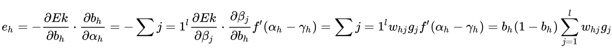-->

$$\begin{align}
e_h &= -\frac{\partial{E}_k}{\partial{b_h}} \cdot \frac{\partial{b_h}}{\partial{\alpha_h}}  \nonumber \\
&= -\sum_{j=1}^l \frac{\partial{E}_k}{\partial{\beta_j}} \cdot \frac{\partial{\beta_j}}{\partial{b_h}} f^\prime(\alpha_h-\gamma_h) \nonumber \\
&= \sum_{j=1}^l w_{hj} g_j f^\prime(\alpha_h-\gamma_h) \nonumber \\
&= b_h(1-b_h) \sum_{j=1}^{l}w_{hj}g_j \nonumber \\
\end{align}$$

下面给出标准BP算法流程：

___

**输入**：

&emsp;&emsp;&emsp;训练集$D$中元素为$(\boldsymbol{x}_k,\boldsymbol{y}_k)$，$k>=1$且$k<=b$

&emsp;&emsp;&emsp;学习率为$\eta$

**过程**：

1： 在$(0, 1)$范围内随机初始化网络中的所有连接权和阈值

2： repeat

3：&emsp;&emsp;for all $(\boldsymbol{x}_k, \boldsymbol{y}_k \in D)$ do

4：&emsp;&emsp;&emsp;&emsp;根据当前参数和$\hat{y}_j^k=f(\beta_j-\theta{j})$计算当前样本输出$\hat{\boldsymbol{y}}_k$；

5：&emsp;&emsp;&emsp;&emsp;根据$g_j=\hat{y}_j^k(1-\hat{y}_j^k)(y_j^k-\hat{y}_j^k)$计算输出层单元的梯度项$g_j$;

6：&emsp;&emsp;&emsp;&emsp;根据$e_h=b_h(1-b_h) \sum_{j=1}^{l}w_{hj}g_j$计算隐藏层单元的梯度项目$e_h$;

7：&emsp;&emsp;&emsp;&emsp;根据$\bigtriangleup{w_{hj}}=\eta g_j b_h$，$\bigtriangleup{\theta_{j}}=-\eta g_j$，$\bigtriangleup{v_{ih}}=\eta e_h x_i$，$\bigtriangleup{\gamma_{h}}=-\eta e_h$更新连接权重$w_{hj}$，$v_{ih}$与阈值$\theta_{j}$，$\gamma_{h}$；

8：&emsp;&emsp;end for

9：until达到停止条件

**输出**：连接权与阈值确定的多层前馈神经网络

---

&emsp;&emsp;上面的标准BP算法的推导，为了简化推导求导过程，假设了隐藏单元以及输出单元的激活函数都是sigmoid函数，事实上，激活函数可以根据训练数据情况，以及预测问题的不同而不同，但是算法整体流程与上述流程一致，需要注意的是不同的激活函数，导数的形式以及结果不同。
