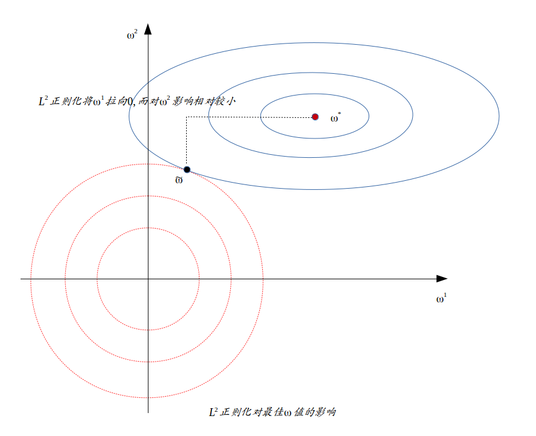
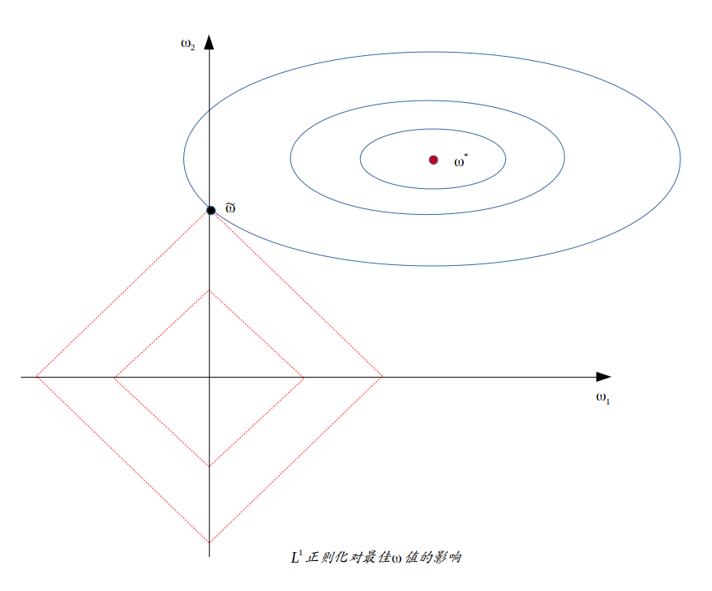
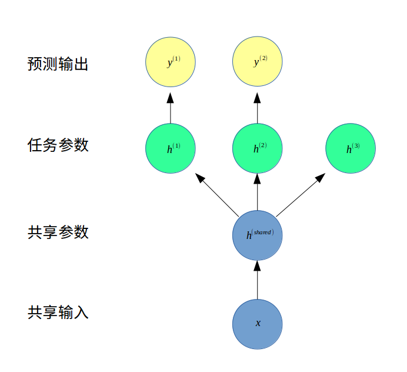
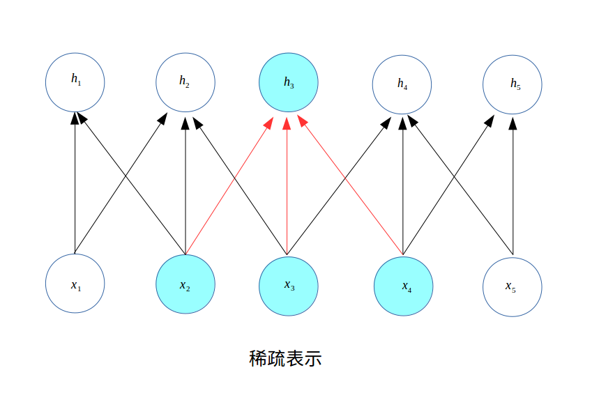
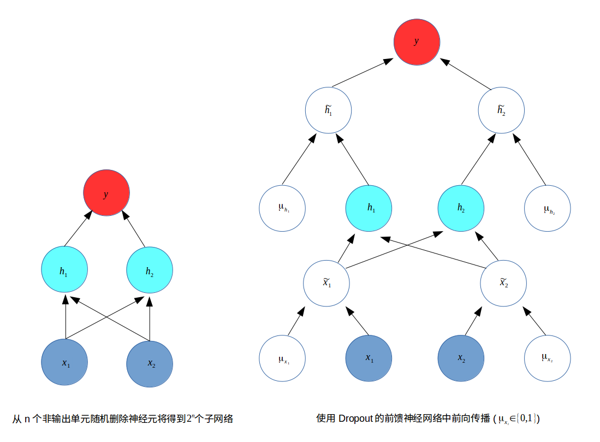

# 深度学习中的正则化
&emsp;&emsp;机器学习中的一个核心问题是设计不仅在训练集上误差小，而且在新样本上泛化能力好的算法。许多机器学习算法都需要采取相应的策略来减少测试误差，这些策略被统称为正则化。而神经网络由于其强大的表示能力经常遭遇过拟合，所以需要使用许多不同形式的正则化策略。

&emsp;&emsp;正则化通过对学习算法的修改，旨在减少泛化误差而不是训练误差。目前有很多正则化策略，有些是向机器学习模型中添加限制参数值的额外约束，有些是向目标函数添加额外项来对参数值进行软约束。在本章中我们将更详细地介绍正则化，重点介绍深度模型的正则化策略，包括参数范数惩罚、提前终止、Dropout等等。

### 基本概念
在开始本章之前，我们回顾以下几个概念：
+ Hessian矩阵：在数学中，海森矩阵（Hessian matrix 或 Hessian）是一个多变量实值函数的二阶偏导数组成的方阵，假设有一实数函数$f(x_1,x_2,...,x_n)$，如果$f$所有的二阶偏导数都存在，那么$f$的Hessian矩阵的第$ij$-项是$\frac{\partial^2f}{\partial x_i\partial x_j}$，即Hessian矩阵为

$$
H(f)=
\left[
\begin{matrix}
    \frac{\partial^2f}{\partial x_1^2} & \frac{\partial^2f}{\partial x_1\partial x_2} & \ldots  & \frac{\partial^2f}{\partial x_1\partial x_n} \\
    \frac{\partial^2f}{\partial x_2\partial x_1} & \frac{\partial^2f}{\partial x_2^2} & \ldots  & \frac{\partial^2f}{\partial x_2\partial x_n} \\
    \vdots & \vdots  & \ddots & \vdots \\
    \frac{\partial^2f}{\partial x_n\partial x_1} & \frac{\partial^2f}{\partial x_n\partial x_2} & \ldots  & \frac{\partial^2f}{\partial x_n^2}
\end{matrix}
\right]
$$

&emsp;&emsp;如果函数$f$在定义域$D$内的每个二阶导数都是连续函数，那么$f$的海森矩阵在$D$区域内为对称矩阵。
+ 极值点：基于Hessian矩阵$H$我们可以判断多元函数的极值情况：
  + 如果$H$是正定矩阵，则临界点一定是局部极小值点。
  + 如果$H$是负定矩阵，则临界点一定是局部极大值点。
  + 如果行列式$\|H\|=0$，需要更高阶的导数来帮助判断。
  + 在其余情况下，临界点不是局部极值点。
+ 实对称矩阵可对角化：若$A$是实对称矩阵，则存在正交矩阵$Q$使得
$QAQ^T=\Lambda=diag(\lambda_1,...,\lambda_n)$，其中$\lambda_i$是矩阵A的特征值。若A可逆（即非奇异），则每个$\lambda_i$都非零且$\lambda_i^{-1}$是$A^{-1}$的特征值，$i=1,2,...,n$。


## 1. 参数范数惩罚
在本节中，我们讨论各种范数惩罚对模型的影响。许多正则化方法（如神经网络、线性回归、逻辑回归）通过对目标函数$J$添加一个参数范数惩罚$\Omega(\theta)$，限制模型的学习能力。将正则化后的目标函数记为$\tilde{J}$:

$$\tilde{J}(\theta;X,y)=J(\theta;X,y)+\alpha\Omega(\theta)$$

其中$\alpha\in [0,+\infty)$是衡量参数范数惩罚程度的超参数。$\alpha=0$表示没有正则化，$\alpha$越大对应正则化惩罚越大。

在神经网络中，参数包括每层线性变换的权重和偏置，我们通常只对权重做惩罚而不对偏置做正则惩罚；使用向量$\omega$表示应受惩罚影响的权重，用向量$\theta$表示所有参数。

### 1.1 $L^2$正则化
$L^2$参数正则化（也称为岭回归、Tikhonov正则）通常被称为权重衰减（weight decay)，是通过向目标函数添加一个正则项$\Omega(\theta)=\frac{1}{2}\|\|\omega\|\|_2^2$使权重更加接近原点。

目标函数

$$
\tilde{J}(\omega;X,y)=J(\omega;X,y)+\frac{\alpha}{2}\omega^T \omega
$$

计算梯度

$$\nabla_{\omega}\tilde{J}(\omega;X,y)=\nabla_{\omega}J(\omega;X,y)+\alpha\omega$$

更新权重

$$\omega\leftarrow \omega-\epsilon(\alpha\omega+\nabla_{\omega}J(\omega;X,y))=(1-\epsilon\alpha)\omega-\epsilon\nabla_{\omega}J(\omega;X,y)
$$

从上式可以看出，加入权重衰减后会导致学习规则的修改，即在每步执行梯度更新前先收缩权重（乘以$(1-\epsilon\alpha)$)。

下面我们进一步分析，令$\omega^{* }$为未正则化的目标函数取得最小训练误差时的权重向量，即$\omega^* =\mathop{\arg\min}_\omega J(\omega)$，在$\omega^*$的邻域对目标函数$J(\theta)$作二阶泰勒展开近似：

$$
\hat{J}(\theta)=J(\omega^* )+\frac{1}{2}(\omega-\omega^* )^TH(\omega-\omega^*)$$

其中$H$是$J$在$\omega^{* }$处的Hessian矩阵。注意这里因为$\omega^{* }$是最优点，所以一阶项即梯度为0，并且$H$是半正定矩阵。

当$\hat{J}$最小时，其梯度为0，即

$$
\nabla_{\omega}\hat{J}(\omega)=H(\omega-\omega^* )$$

在上式中加入权重衰减的梯度，用$\tilde{\omega}$表示此时正则化后的最优点：

$$H(\tilde{\omega}-\omega^*)+\alpha\tilde{\omega}=0$$

$$(H+\alpha I)\tilde{\omega}=H\omega^*$$

$$\tilde{\omega}=(H+\alpha I)^{-1}H\omega^*$$

当$\alpha\rightarrow 0$时，正则化的解$\tilde{\omega}\rightarrow\omega^*$。因为$H$是实对称矩阵，所以可以对角化，即存在正交矩阵$Q$（由$H$特征向量组成）使得$H=Q\Lambda Q^T$。于是有：

$$
\tilde{\omega} 
=(Q\Lambda Q^T+\alpha I)^{-1}Q\Lambda Q^T\omega^*
= [Q(\Lambda+\alpha I)Q^T]^{-1}Q\Lambda Q^T\omega^*
=Q(\Lambda+\alpha I)^{-1}\Lambda Q^T\omega^*
$$

$$
Q^T\tilde{\omega}=(\Lambda+\alpha I)^{-1}\Lambda Q^T \omega
$$

也就是说，权重衰减的效果是沿着由$H$的特征向量所定义的轴缩放$\omega^*$，缩放因子是$\frac{\lambda_i}{\lambda_i+\alpha}$。

1）沿特征值较大的方向正则化影响较小。即$\lambda_i \gg\alpha$时，$\frac{\lambda_i}{\lambda_i+\alpha}\simeq 1$。

2）沿特征值较小的方向，权重分量收缩到0。即$\lambda_i\ll\alpha$时，$\frac{\lambda_i}{\lambda_i+\alpha}\simeq 0$。



### 1.2 $L^1$正则化
将$L^2$正则化的参数惩罚项$\Omega(\theta)$由权重衰减项修改为各个参数的绝对值之和，即得到$L^1$正则化：

$$
\Omega(\theta)=\|\omega\|_1=\sum_i |\omega_i|
$$

目标函数：

$$
\tilde{J}(\omega;X,y)=J(\omega;X,y)+\alpha \|\omega\|_1
$$

梯度：

$$\nabla_{\omega}\tilde{J}(\omega;X,y) = \nabla_{\omega}J(\omega;X,y)+\alpha sgn(\omega)$$

其中$sgn(x)$为符号函数，取各个元素的正负号。与之前的分析一样，将目标函数作二次泰勒展开近似：

$$\hat{J}(\omega;X,y)=J(\omega^* ;X,y)+\frac{1}{2}(\omega-\omega^*)^T H(\omega - \omega^*)$$

我们进一步假设Hessian是对角矩阵，即$H=diag([H_{1,1},...,H_{n,n}])$，$H_{i,i}>0$，于是$L^1$正则化目标函数二次近似为：

$$\hat{J}(\omega;X,y)=J(\omega^*;X,y)+\frac{1}{2}(\omega-\omega^*)^Tdiag(H_{1,1}, H_{2,2},...,H_{n,n})(\omega-\omega^*)+\alpha\|\omega\|_1
$$

$$=J(\omega^*;X,y)+\sum_i\left[\frac{1}{2}H_{i,i}(\omega-\omega^*)^2+\alpha|\omega_i|\right]$$

最小化这个近似函数，有如下形式的解析解：

$$\omega_i=sgn(\omega_i^*)max\{|\omega_i^* |-\frac{\alpha}{H_{i,i}},0\}$$

对每个$i$，我们考虑$\omega_i^*>0$的情形：

1）$\omega_i^* \leq\frac{\alpha}{H_{i,i}}$，正则化目标中的最优值是$\omega_i=0$。

2）$\omega_i^{* }> \frac{\alpha}{H_{i,i}}$，
$\omega_i=\omega_i^{*}-\frac{\alpha}{H_{i,i}}$，正则化不会将$\omega_i$的最优值推至0，而是在该方向上移动 $\frac{\alpha}{H_{i,i}}$ 的距离。



### 1.3 总结$L^2$与$L^1$正则化

+ 相比$L^2$正则化，$L^1$正则化会产生更稀疏的解。如果考虑Hessian矩阵是对角正定矩阵，我们得到$L^2$正则化的最优解是$\tilde{\omega_i}=\frac{H_{i,i}}{H_{i,i}+\alpha}\omega_i^{* }$。如果$\omega_i^{* }\neq 0$，则 $\tilde{\omega_i}\neq 0$，这说明$L^2$正则化不会使参数变得稀疏，而$L^1$正则化有可能通过足够大的$\alpha$实现稀疏。
+ 正则化策略可以被解释为最大后验（MAP）贝叶斯推断。
  + $L^2$正则化相当于权重是`高斯先验`的MAP贝叶斯推断。
  + $L^1$正则化相当于权重是`Laplace先验`的MAP贝叶斯推断。
    
    最大后验估计选择后验概率最大的点：

    $$\Theta_{MAP}=\mathop{\arg\max}_{\theta}p(\theta|x)=\mathop{\arg\max}_{\theta}\log p(x|\theta)+\log p(\theta)$$

    右边的$\log p(x\|\theta)$对应标准的对数似然项，$\log p(\theta)$对应先验分布。在神经网络中上述公式中的$\theta$即我们考虑的权重$\omega$。
    
    如果先验是高斯分布$\mathcal{N}(\omega;0,\frac{1}{\alpha}I^2)$，即$p(\omega)\propto exp(-\frac{\alpha}{2}\omega^T\omega)$，从而有$\log p(\omega)\propto \alpha\omega^T\omega$。因此$L^2$正则化权重衰减对应着权重是高斯先验的MAP贝叶斯推断。

    如果先验是Laplace分布$Laplace(\omega;0,\frac{1}{\alpha})$，即$p(\omega)=\frac{\alpha}{2}\exp(-\alpha\|x\|)$，对数先验项

    $$\log p(\omega)=\sum_i\log Laplace(\omega_i;0,\frac{1}{\alpha})=-\alpha\|\omega\|_1+n\log \alpha-n\log 2
    $$

    与$L^1$正则化代价函数惩罚项$\alpha\Omega(\omega)=\alpha \sum_i \|\omega_i\|$等价。


## 2. 作为约束的范数惩罚
考虑参数范数正则化的代价函数：

$$\tilde{J}(\theta;X,y)=J(\theta;X,y)+\alpha\Omega(\theta)$$

在上一节中考虑的是无约束问题，如果想约束$\Omega(\theta)<k$，$k$是某个常数，可以构造广义Lagrange函数

$$\mathcal{L}(\theta,\alpha;X,y)=J(\theta;X,y)+\alpha(\Omega(\theta)-k)$$

该约束问题的解是

$$\theta^*=\arg\min_\theta\max_{\alpha,\alpha\geq 0}\mathcal{L}(\theta,\alpha)$$

可以通过调节$\alpha$与$k$的值来扩大或缩小权重的约束区域。较大的$\alpha$将得到一个较小的约束区域，而较小的$\alpha$将得到一个较大的约束区域。

使用显示约束（相比于惩罚约束）的优点：

+ 可以先用梯度下降法计算$J(\theta)$的下降步，再投影到区域$\Omega(\theta)<k$的最近点。当知道什么$k$合适时，不需要寻找对应的$\alpha$值。
+ 惩罚可能导致目标函数非凸，而使得算法陷入局部极小。
+ 重投影的显示约束对优化过程增加了一定的稳定性。例如当学习率较高时，很可能进入正反馈，即大的权重诱导大的梯度，使权重获得较大的更新。如果持续更新增加权重大小，则会使$\theta$迅速增大而远离原点发生溢出。

## 3. 欠约束问题
机器学习中许多线性模型，如线性回归和PCA，都依赖与矩阵$X^TX$求逆，如果$X^TX$不可逆，这些方法就会失效。这种情况下，正则化的许多形式对应求逆$X^TX+\alpha I$，这个正则化矩阵是可逆的。大多数正则化方法能够保证应用于欠定问题的迭代方法收敛。

## 4. 数据集增强

让机器学习模型泛化得更好的最好办法是使用更多的数据进行训练，因此需要在有限的数据中创建假数据并添加到训练集中。数据集增强在对象识别领域是特别有效的方法。
+ 数据集的各种变换，如对图像的平移、旋转和缩放。
+ 在输入层注入噪声，也可以看作数据集增强的一种方法（如去噪自编码器）。通过将随机噪声添加到输入再进行训练能够大大改善神经网络的健壮性。

## 5. 噪声鲁棒性
+ 将噪声加入到输入。在一般情况下,注入噪声远比简单地收缩参数强大,特别是噪声被添加到隐藏单元时会更加强大（如Dropout）。对于某些模型而言，向输入添加方差极小的噪声等价于对权重施加范数惩罚。

+ 将噪声加入到权重。这项技术主要用于循环神经网络。这可以被解释为关于权重的贝叶斯推断的随机实现。贝叶斯学习过程将权重视为不确定的,并且可以通过概率分布表示这种不确定性，向权重添加噪声是反映这种不确定性的一种实用的随机方法。

  + 例如对回归问题，假设对每个输入，网络权重添加随机扰动$\epsilon \sim \mathcal{N}(\epsilon;0,\eta I)$，将扰动后的模型记为 $\hat{y}\_{\epsilon_{\omega}}(x)$。目标函数为：
  
  $$\tilde{J}_{\omega}=\mathbb{E}_{p(x,y,\epsilon_\omega)}[(\hat{y}_{\epsilon_\omega}(x)-y)^2]=\mathbb{E}_{p(x,y,\epsilon_\omega)}[\hat{y}_{\epsilon_\omega}^2(x)-2y\hat{y}_{\epsilon_\omega}(x)+y^2]$$

  + 最小化带权重噪声的$J$等价于最小化附加正则项：$\eta\mathbb{E}\_{p(x,y)}[\|\|\nabla_\omega \hat{y}(x)\|\|^2]$的$J$。

  + 这种正则化鼓励参数进入权重小扰动对输出相对影响较小的参数空间区域。换句话说，它推动模型进入对权重小的变化相对不敏感的区域，找到的点不只是极小点，而且是由平坦区域所包围的极小点

+ 将噪声加入到输出。即显式地对标签上的噪声进行建模，假设训练集上的标记$y$正确的概率是$1-\epsilon$，其他标签是正确的可能性是$\epsilon$。例如，标签平滑通过把确切分类目标从$0$和$1$换成$\frac{\epsilon}{k-1}$和$1-\epsilon$，正则化具有$k$个输出的softmax函数的模型。softmax函数值永远在$(0,1)$区间内而达不到$0$或$1$，标签平滑的优势是能够防止模型追求确切概率而不影响模型学习正确分类。

## 6. 半监督学习
+ 在半监督学习的框架下，$P(x)$产生的未标记样本和$P(x, y)$中的标记样本都用于估计$P(y \| x)$。在深度学习的背景下，半监督学习通常指的是学习一个表示$h = f (x)$，学习表示的目的是使相同类中的样本有类似的表示。
+ 我们可以构建这样一个模型，其中生成模型$P(x)$或$P(x, y)$与判别模型$P(y \| x)$共享参数，而不用分离无监督和监督部分。

## 7. 多任务学习
+ 多任务学习是通过合并几个任务中的样例(可以视为对参数施加的软约束)来提高泛化的一种方式。当模型的一部分被多个额外的任务共享时，这部分将被约束为良好的值，通常会带来更好的泛化能力。
+ 下图展示了多任务学习的一种普遍形式。不同的监督任务共享相同的输入$x$和中间表示层$h^{(shared)}$，能学习共同的因素池。

+ 从深度学习的观点看，底层的先验知识为：能解释数据变化的因素中，某些因素是跨多个任务共享的。

## 8. 提前终止
由于神经网络强大的表示能力，当训练次数过多时会经常遭遇过拟合，即训练误差会随时间推移减少，而验证集误差会再次上升。
+ 如果我们只要返回使验证集误差最低的参数，就可以获得验证集误差更低的模型。这种策略被称为提前终止（early stopping）。由于它的有效性和简单性，这可能是深度学习中最常用的正则化形式。
+ 提前终止是一种非常不显眼的正则化形式，几乎不需要改变基本训练过程、目标函数。而使用权重衰减则必须小心不能使用太多的权重衰减，否则容易陷入局部极小点。

### 8.1 提前终止算法
___

**输入**：$n$为评估间隔步数，$p$为patience（即观察到$p$次更差的验证集表现后终止），$\theta_0$为初始参数

**过程**：

1： 初始化$\theta=\theta_0$，$i=0$，$j=0$，$v=\infty$，$\theta^* = \theta$，$i^* = i$

2： $while(j<p)$ $do$

3：&emsp;&emsp;运行训练算法$n$步，更新$\theta$。

4：&emsp;&emsp;$i=i+n$，$v'=ValidationSetError(\theta)$

5：&emsp;&emsp;$if (v'<v)$ $then$

6：&emsp;&emsp;&emsp;&emsp;$j=0$，$\theta^* =\theta$，$i^{* }=i$，$v=v' $

7：&emsp;&emsp;$else$


8：&emsp;&emsp;&emsp;&emsp;$j=j+1$

9：&emsp;&emsp;$end$ $if$

10：$end$ $while$

**输出**：最佳参数$\theta^* $，最佳训练步数$i^* $

---

### 8.2 提前终止的优点
+ 由于限制了训练迭代次数，减少了训练时的计算成本
+ 具有正则化效果而不需要添加惩罚项或计算其梯度。

### 8.3 提前终止相当于$L^2$正则化
提前终止为何具有正则化效果？其真正机制可理解为将优化过程的参数空间限制在初始参数值$\theta_0$的小邻域内。假如学习率为$\epsilon$，进行$\tau$次训练迭代，则$\frac{1}{\epsilon\tau}$等价于权重衰减系数$\alpha$。我们下面进行证明：

我们考虑二次误差的简单线性模型，采用梯度下降法，参数$\theta=\omega$，代价函数$J$在最优值$\omega^*$附近作泰勒级数二阶展开近似：

$$\hat{J}(\theta)=J(\omega^* )+\frac{1}{2}(\omega-\omega^* )^TH(\omega-\omega^*)$$

其中$H$是$J$关于$\omega$在$\omega^{* }$点的Hessian。由于$\omega^{* }$是全局最小点，$H$是半正定对称矩阵，因此可以对角化，即存在正交矩阵$Q$使得$H=Q\Lambda Q^T$。进一步，$Q$是特征向量的一组标准正交基，$\Lambda$是（对角元素是$H$特征值的）对角矩阵。

在局部泰勒级数逼近下，梯度由下式给出：

$$\nabla\hat{J}(\omega)=H(\omega-\omega^*)$$

将权重参数初始化为原点，即$\omega^{(0)}=0$，梯度下降法由下面公式给出：

$$\omega^{(\tau)}=\omega^{(\tau-1)}-\epsilon\nabla_{\omega}\hat{J}(\omega^{(\tau-1)})=\omega^{(\tau-1)}-\epsilon H(\omega^{(\tau-1)}-\omega^*)$$

$$\omega^{(\tau)}-\omega^* =(I-\epsilon H)(\omega^{(\tau-1)}-\omega^*)$$

利用$H$的正交分解$H=Q\Lambda Q^T$，得到：

$$\omega^{(\tau)}-\omega^* =(I-\epsilon Q\Lambda Q^T)(\omega^{(\tau-1)}-\omega^*)$$

$$Q^T(\omega^{(\tau)}-\omega^* )=(I-\epsilon \Lambda) Q^T(\omega^{(\tau-1)}-\omega^* )=\ldots=(I-\epsilon\Lambda)^\tau Q^T(\omega^{(0)}-\omega^*)$$

假定$\epsilon$足够小以保证$\|1-\epsilon\lambda_i\|<1$，则经过$\tau$次迭代后：

$$Q^T\omega^{(\tau)}=Q^T\omega^* -(I-\epsilon \Lambda)^\tau Q^T\omega^* =[I-(I-\epsilon \Lambda)^\tau] Q^T\omega^*$$

我们回顾1.1节中$L^2$正则化的形式：$Q^T\tilde{\omega}=(\Lambda+\alpha I)^{-1}\Lambda Q^T \omega^*$，注意到$(\Lambda+\alpha I)^{-1}(\Lambda+\alpha I)=I$，即$(\Lambda+\alpha I)^{-1}\Lambda=I-(\Lambda+\alpha I)^{-1}\alpha$，于是有：

$$
Q^T\tilde{\omega}=[I-(\Lambda+\alpha I)^{-1}\alpha] Q^T \omega^*
$$

对比这两个式子右端，如果满足

$$(I-\epsilon\Lambda)^\tau=(\Lambda+\alpha I)^{-1}\alpha$$

那么$L^2$正则化和提前终止是等价的（在目标函数的二阶近似下）。

利用级数展开$\log (1+x)=x-\frac{x^2}{2}+\ldots+\frac{(-1)^{n-1}x^n}{n}+\ldots$该等式即：

$$\tau\log (I-\epsilon\Lambda)=-\log (I+\frac{1}{\alpha}\Lambda)$$

$$\tau(-\epsilon\Lambda-\ldots)=-(\frac{1}{\alpha}\Lambda-\ldots)$$

如果所有$\lambda_i$是小的（$\epsilon\lambda_i\ll 1$且$\frac{\lambda_i}{\alpha}\ll 1$），则：

$$\alpha \approx \frac{1}{\tau\epsilon}$$

### 8.4 小结——提前终止与$L^2$正则化对比
+ 提前终止和$L^2$正则化是等价的（在二阶近似、$\lambda_i$小的情况下），即$\frac{1}{\epsilon\tau}\approx \alpha$。也就是说训练迭代次数$\tau$和学习率$\epsilon$起着与$L^2$正则化（权重衰减）系数$\alpha$成反比的作用。
+ 长度为$\tau$的轨迹结束于$L^2$正则化目标的极小点，但是提前终止通常涉及监控验证集误差，以便在空间特别好的点处终止轨迹。
+ 提前终止比$L^2$正则化更具有优势，提前终止能自动确定正则化的正确量，而权重衰减需要进行多个不同超参数的训练实验。

## 9. 参数绑定与参数共享
参数范数惩罚或约束是相对于固定区域或点，如$L^2$正则化是对参数偏离$0$固定值进行惩罚。但有时我们需要对模型参数之间的相关型进行惩罚，使模型参数尽量接近或者相等。
+ 参数共享：强迫模型某些参数相等
+ 主要应用：卷积神经网络（CNN）
+ 优点：显著降低了CNN模型的参数数量（CNN模型参数数量经常是千万量级以上），减少模型所占用的内存，并且显著提高了网络大小而不需要相应的增加训练数据。

## 10. 稀疏表示
稀疏表示也是卷积神经网络经常用到的正则化方法。$L^1$正则化会诱导稀疏的参数，使得许多参数为$0$；而稀疏表示是惩罚神经网络的激活单元，稀疏化激活单元。换言之，稀疏表示是使得每个神经元的输入单元变得稀疏，很多输入是0。


例如下图，$h_3$只依赖于上一层的3个神经元输入$x_2$、$x_3$、$x_4$，而其他神经元到$h_3$的输入都是0。



## 11. Bagging和其他集成方法
Bagging(bootstrap aggregating)是通过结合几个模型降低泛化误差的技术。主要想法是分别训练几个不同的模型，然后让所有模型表决测试样例的输出。这是机器学习中常规策略的一个例子,被称为模型平均(model averaging)。采用这种策略的技术被称为集成方法。

Bagging是一种允许重复多次使用同一种模型、训练算法和目标函数的方法。具体来说,Bagging涉及构造$k$个不同的数据集。每个数据集从原始数据集中重复采样构成，和原始数据集具有相同数量的样例。

模型平均是一个减少泛化误差的非常强大可靠的方法。例如我们假设有$k$个回归模型，每个模型误差是$\epsilon_i$，误差服从零均值、方差为$v$、协方差为$c$的多维正态分布。则模型平均预测的误差为$\frac{1}{k}\sum_i\epsilon_i$，均方误差的期望为

$$\mathbb{E}\left[(\frac{1}{k}\sum_i\epsilon_i)^2\right]=\frac{1}{k^2}\mathbb{E}\left[\sum_i(\epsilon_i^2+\sum_{i\neq j}\epsilon_i\epsilon_j)\right]=\frac{1}{k}v+\frac{k-1}{k}c$$

在误差完全相关即$c=v$的情况下，均方误差为$v$，模型平均没有帮助。在误差完全不相关即$c=0$时，模型平均的均方误差的期望仅为$\frac{1}{k}v$。这说明集成平方误差的期望随集成规模的增大而线性减少。

其他集成方法，如Boosting，通过向集成逐步添加神经网络，可以构建比单个模型容量更高的集成模型。

## 12. Dropout
Dropout可以被认为是集成大量深层神经网络的实用Bagging方法。但是Bagging方法涉及训练多个模型，并且在每个测试样本上评估多个模型。当每个模型都是一个大型神经网络时，Bagging方法会耗费很多的时间和内存。而Dropout则提供了一种廉价的Bagging集成近似，能够训练和评估指数级数量的神经网络。

### 12.1 Dropout基本原理
+ Dropout训练的集成包括所有从基础网络中除去神经元（非输出单元）后形成的子网络。只需将一些单元的输出乘零就能有效的删除一个单元（称之为乘零的简单Dropout算法）。假如基本网络有$n$个非输出神经元，则一共有$2^n$个子网络。
+ Dropout的目标是在指数级数量的神经网络上近似Bagging过程。具体来说，在训练中使用Dropout时，我们会使用基于小批量产生较小步长的学习算法，如随机梯度下降。

  + 每次在小批量中加载一个样本，然后随机抽样（用于网络中所有输入和隐藏单元的）不同二值掩码。
  + 对于每个单元，掩码是独立采样的。通常输入单元被包括的概率为$0.8$，隐藏单元被包括的概率为$0.5$。
  + 然后与之前一样，运行前向传播、反向传播和学习更新。



### 12.2 Dropout与Bagging区别
+ Bagging：所有模型都是独立的。

&emsp;&emsp;Dropout：所有模型共享参数，其中每个模型继承父神经网络参数的不同子集。参数共享使得在有限内存下表示指数级数量的模型变得可能。
+ Bagging：每个模型在其相应的训练集上训练到收敛。

&emsp;&emsp;Dropout：大部分模型没有被显式地被训练，因为父神经网络通常很大，几乎不可能采样完指数级数量的子网络；取而代之的是，在单个步骤中训练一小部分子网络，通过参数共享使得剩余的子网络也有好的参数设定。
+ 除此之外，Dropout与Bagging算法一样。例如每个子网络中遇到的训练集是有放回采样的原始训练集的一个子集。
+ 模型输出：
  + Bagging情况下，每个模型$i$产生一个概率分布$p^{(i)}(y\|x)$，集成的预测由这些分布的算术平均值给出： 
  
  $$\frac{1}{k}\sum_{i=1}^{k}p^{(i)}(y|x)$$

  + Dropout情况下，通过掩码$\mu$定义每个子模型的概率分布$p(y\|x,\mu)$。所有掩码的算术平均值由下式给出：

  $$\sum_{\mu}p(\mu)p(y|x,\mu)$$

  其中$p(\mu)$是训练时采样$\mu$的概率分布。但该求和包含指数级的项，一般是不可计算的，我们可以通过采样近似推断，即平均许多掩码的输出。通过几何平均直接定义的非标准化概率分布由下式给出：

  $$\tilde{p}_{ensemble}(y|x)=\sqrt[2^d]{\prod_{\mu}p(y|x,\mu)}$$

  其中$d$是可被丢弃的单元数。为了作出预测，需要进行标准化，例如对均匀分布的$\mu$，可按下式进行标准化：

  $$p_{ensemble}(y|x)=\frac{\tilde{p}_{ensemble}(y|x)}{\sum_{y'}\tilde{p}_{ensemble}(y'|x)}$$

典型的dropout代码示例参考如下，感谢作者[Jipeng Huang](https://github.com/hjptriplebee) 提供。
```python
# coding: UTF-8
'''''''''''''''''''''''''''''''''''''''''''''''''''''
   file name: dropout.py
   create time: Fri 29 Sep 2017 03:00:16 AM EDT
   author: Jipeng Huang 
   e-mail: huangjipengnju@gmail.com
   github: https://github.com/hjptriplebee
'''''''''''''''''''''''''''''''''''''''''''''''''''''
#mnist data
import tensorflow.examples.tutorials.mnist as mnist
mnist = mnist.input_data.read_data_sets("MNIST_data/", one_hot=True)

import tensorflow as tf
#ground truth
x = tf.placeholder(tf.float32, [None, 784])
y_ = tf.placeholder("float", [None,10])

#dropout
p = tf.placeholder(tf.float32)

#weight and bias
W = tf.Variable(tf.zeros([784,10]))
b = tf.Variable(tf.zeros([10]))

#nn
h1 = tf.nn.dropout(x, keep_prob = p)
y = tf.nn.softmax(tf.matmul(h1,W) + b)

#loss and train
cross_entropy = -tf.reduce_sum(y_*tf.log(y))
train_step = tf.train.GradientDescentOptimizer(0.01).minimize(cross_entropy)

with tf.Session() as sess:
    sess.run(tf.global_variables_initializer())
    for i in range(5000):
        batch_xs, batch_ys = mnist.train.next_batch(100)
        sess.run(train_step, feed_dict={x: batch_xs, y_: batch_ys, p : 0.95})
    correct_prediction = tf.equal(tf.argmax(y,1), tf.argmax(y_,1))
    accuracy = tf.reduce_mean(tf.cast(correct_prediction, "float"))
    print(sess.run(accuracy, feed_dict={x: mnist.test.images, y_: mnist.test.labels, p : 1.0}))

```

### 12.3 Dropout小结
+ Dropout优点
  + 计算方便。训练过程中使用Dropout产生$n$个随机二进制数与状态相乘即可。每个样本每次更新的时间复杂度：$O(n)$，空间复杂度：$O(n)$。
  + 适用广。Dropout不怎么限制适用的模型或训练过程，几乎在所有使用分布式表示且可以用随机梯度下降训练的模型上都表现很好。包括：前馈神经网络、概率模型、受限波尔兹曼机、循环神经网络等。
  + 相比其他正则化方法（如权重衰减、过滤器约束和稀疏激活）更有效。也可与其他形式的正则化合并，得到进一步提升。
+ Dropout缺点
  + 不适合宽度太窄的网络。否则大部分网络没有输入到输出的路径。
  + 不适合训练数据太小（如小于5000）的网络。训练数据太小时，Dropout没有其他方法表现好。
  + 不适合非常大的数据集。数据集大的时候正则化效果有限（大数据集本身的泛化误差就很小），使用Dropout的代价可能超过正则化的好处。
+ Dropout衍生方法
  + Dropout作用于线性回归时，相当于每个输入特征具有不同权重衰减系数的$L^2$权重衰减，系数大小由其方差决定。但对深度模型而言，二者是不等同的。
  + 快速Dropout (Wang and Manning，2013)：利用近似解的方法，减小梯度计算中的随机性析解，获得更快的收敛速度。
  + DropConnect (Wan，2013)：将一个标量权重和单个隐藏单元状态之间的每个乘积作为可以丢弃的一个单元。
  + $\mu$不取二值，而是服从正态分布，即$\mu\sim\mathcal{N}(1,I)$（Srivastava，2014）。

## 13. 对抗训练
对抗样本主要用于计算机安全领域。在正则化背景下，通过对抗训练（adversarial training）可以减少原有独立同分布的测试集的错误率——在对抗扰动的训练集样本上训练网络。

主要原因之一是高度线性，神经网络主要是基于线性模块构建的。输入改变$\epsilon$，则权重为$\omega$的线性函数将改变$\epsilon\|\|\omega\|\|_1$，对于高维的$\omega$这是一个非常大的数。

对抗训练通过鼓励网络在训练数据附件的局部区域恒定来限制这一个高度敏感的局部线性行为。

## 14. 切面距离、正切传播和流形正切分类器
利用流形假设，假设数据位于低维流形附近来克服维数灾难。
+ 切面距离算法
+ 正切传播算法
+ 流形正切分类器