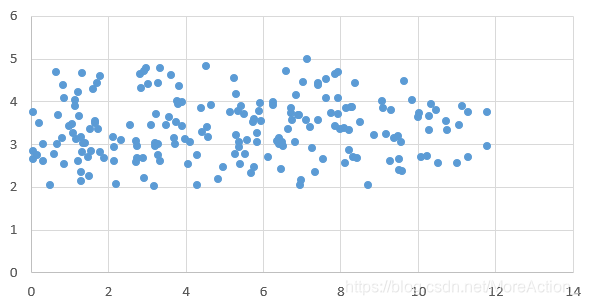
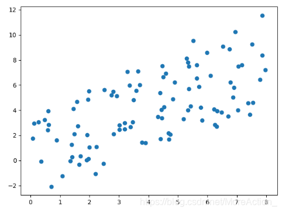
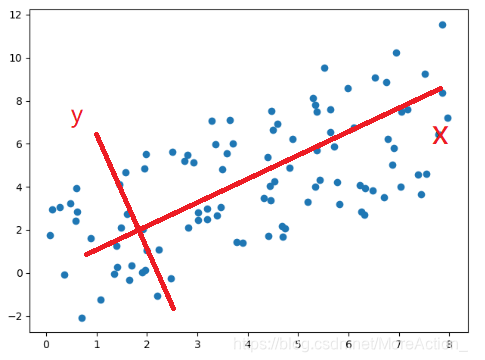

# 主成分分析（Principal Component Analysis, PCA）

## 什么是主成分分析（PCA）？

主成分分析（Principal Component Analysis, PCA）是一种用于数据降维的技术（非监督）。它的主要目的是通过线性变换，将原始数据投影到一个新的坐标系中，在这个坐标系中，数据方差最大的方向称为“主成分”。PCA通过找到数据中最重要的方向（即主成分），发现更便于人们能够理解的特征，来减少数据的维度，同时保留尽可能多的信息。

如果单看概念，对于刚接触PCA的同学多少会觉得有些难懂。且看下面这个例子：
假设我们有一组二维数据（x,y），它的分布如下图：



可以看到，数据在x轴上的变化大，而在y轴变化小，变化小意味着数据在这个特征上没有太大的差异，因此它包含的信息就比较少，那么我们就可以认为它是不重要的或者是噪音，从而可以直接将这个维度上的数据舍去，只用x轴上的数据来代替。

那么假如数据是这样分布的呢？



这个图我们就不太好看出到底是谁比较重要了，因为x和y变化都比较大，那么就不能降维了吗？非也，假如我们旋转一下坐标系



新坐标系下数据的坐标值就是数据在坐标轴上的投影，这时候的情况就和上面那个例子一样了。
从这个例子也可以看到，数据本身的具体数值其实是不重要的，重要的是数据之间的关系，数据的整体分布。原来的数据是在$E$坐标系下，然后我们换了一个坐标系来表示，本质上相当于对数据进行了一次正交变换（从数学公式看），在新的坐标系下，我们能更清楚的看到数据的特点，这为我们后续进一步操作数据提供了可能。

PCA其实做的就是这么一件事，求出了一个正交矩阵P，然后用这个矩阵对数据进行正交变换得到新的数据：
$$Y=PX$$
正交变换就相当于换了一个坐标系，所以其结果就是我们换了一个坐标系来观察数据，假如我们在这个坐标系下取前k个变化最大的轴上的数据，这就实现了降维。

按照两阶段来理解PCA会容易得多，简单来说就是：第一阶段找了一个新的坐标系来表示数据，这个新的坐标系不是随便找的，是要求能最大限度的看出每个轴上的数据变化大小，第二阶段在新坐标系下取前k个变化最大的轴上的数据，从而实现降维。

## PCA的原理

PCA的核心在于线性代数和统计学中的特征值分解和协方差矩阵的运用，接下来逐步介绍PCA原理的数学基础。

### 1 标准化数据

在开始PCA之前，通常需要对数据进行标准化。标准化的目的是为了让不同特征（变量）处于相同的尺度上。例如，如果一个特征的数值范围是0到1，而另一个特征的范围是1000到2000，那么第二个特征会对结果产生不成比例的影响。通过标准化，我们可以让每个特征的均值为0，标准差为1，使其具有相同的量纲。

$$
X_{\text{标准化}} = \frac{X - \mu}{\sigma}
$$


其中，$X$ 是原始数据，$\mu$ 是特征的均值，$\sigma$ 是特征的标准差。这个公式确保每个特征的平均值为0，标准差为1，从而避免量纲问题对PCA的影响。

### 2 计算协方差矩阵

接下来，我们需要构建数据的协方差矩阵。协方差矩阵用来衡量数据集中不同特征之间的相关性，帮助我们找到哪些特征变化趋势相似，哪些特征彼此独立。

协方差的直观理解是：如果两个特征的协方差很大，说明它们大致随着同样的趋势变化，反之，协方差接近0表示两者相互独立。PCA的目标是找到这些相关性，简化数据的表示。

协方差矩阵的计算公式为：

$$
\Sigma = \frac{1}{n-1} X_{\text{标准化}}^T X_{\text{标准化}}
$$

其中，$\Sigma$ 是协方差矩阵，$X_{\text{标准化}}$ 是标准化后的数据矩阵，$n$ 是样本数量。协方差矩阵是对称的，矩阵的元素 $\Sigma_{ij}$ 表示第 $i$ 个特征和第 $j$ 个特征之间的协方差。

### 3 特征值分解

PCA的关键步骤是对协方差矩阵进行特征值分解。这一步帮助我们找到数据分布最广的方向，也就是主成分。特征值和特征向量是描述数据在这些方向上扩展程度的工具。

我们可以将协方差矩阵分解为一组特征值和特征向量：

$$
\Sigma \mathbf{v}_i = \lambda_i \mathbf{v}_i
$$

其中：$\lambda_i$ 是第 $i$ 个特征值，表示数据在这个特征向量方向上的方差大小（也就是信息量的大小）。
$\mathbf{v}_i$ 是第 $i$ 个特征向量，表示数据在这个方向上的变化方向。
可以简单理解为：特征值告诉我们每个方向上信息的多少，而特征向量告诉我们这些信息的具体方向。特征值越大，表示该方向上数据的方差越大，该方向的信息就越重要。

### 4 选择主要成分（降维）（投影）

在得到所有特征值和特征向量之后，下一步是选择主要成分。我们通常选择具有较大特征值的前几个特征向量作为主要成分。为什么？因为这些特征向量表示了数据中变化最显著的方向，也就是包含最多信息的方向。

我们将原始数据投影到这些主要成分上，实现降维。投影的过程可以理解为将数据转换到新的坐标系，这个坐标系由主要成分决定。新坐标系的每个轴代表一个主成分方向。

投影公式为：

$$
X_{\text{PCA}} = X_{\text{标准化}} \mathbf{V}_k
$$

其中，$X_{\text{PCA}}$ 是投影后的低维数据，$\mathbf{V}_k$ 是由前 $k$ 个特征向量构成的矩阵。这一步的结果是，我们将数据从原始的高维空间压缩到了一个低维空间，但尽可能保留了数据中的主要信息。

通过这种方式，PCA可以显著减少数据维度，同时保留大部分重要信息。常见的选择是保留能够解释95%以上方差的前几个主成分，这样既能简化数据，又不至于丢失太多有用信息。

总体而言，PCA就像是在寻找数据中最有用的“方向”，让我们能够从多个复杂的特征中提取出最重要的几个维度，而不会丢失太多关键信息。通过特征值分解和数据投影，PCA帮助我们从更高维度的数据中找到最有用的特征，实现数据的简化和高效表示。

## PCA的代码实现

让我们通过代码实现PCA，并结合上面的数学步骤。这里我们使用Python的scikit-learn库来实现PCA，并使用经典的Iris数据集。

### 1 代码实现

#### 安装所需库

首先，我们需要安装相关的Python库,如下代码：

```bash
pip install numpy pandas scikit-learn matplotlib
```
其中，numpy跟pandas用于数据处理和操作，scikit-learn库当中集成了PCA的代码实现，我们可以直接调用，而matplotlib用于绘制图形，帮助我们实现可视化操作。

### 2 代码逐步实现步骤

#### 2.1 加载数据

我们使用scikit-learn中的Iris数据集，它包含三种鸢尾花的特征数据和对应的分类标签。我们将使用这些数据来演示PCA如何帮助我们简化数据。

```python
from sklearn.datasets import load_iris

# 加载Iris数据集
iris = load_iris()
X = iris.data  # 特征数据
y = iris.target  # 标签
```

其中，X 是数据集中花的特征，比如花瓣和花萼的长度和宽度。
y 是分类标签，代表三种不同种类的鸢尾花。

#### 2.2 数据标准化

正如我们之前讨论的，PCA对不同量纲的特征比较敏感。所以我们先要标准化数据，把所有特征的均值变成0，标准差变成1，确保每个特征对PCA的贡献是公平的。

```python
from sklearn.preprocessing import StandardScaler

# 标准化数据
scaler = StandardScaler()
X_scaled = scaler.fit_transform(X)
```

StandardScaler函数能够将每个特征的数值调整到相同的尺度，防止某些特征因为数值较大而主导结果。

#### 2.3 执行PCA

接下来，我们可以使用PCA类来对数据进行降维了。在这个例子中，我打算将数据降到2维，因为这样可以方便我们进行可视化操作。

```python
from sklearn.decomposition import PCA

# 执行PCA，将数据降到2个主成分
pca = PCA(n_components=2)
X_pca = pca.fit_transform(X_scaled)
```

其中，n_components=2表示我们希望将数据降到两个主成分维度。PCA会自动找出这两个最重要的方向，并把数据投影到这两个方向上。而fit_transform会对标准化后的数据执行PCA并返回降维后的数据。

#### 2.4 查看方差解释率

PCA不仅仅是降维，它还告诉我们每个主成分解释了数据中多少的方差。方差可以理解为数据的变化或信息量。解释的方差越大，说明这个主成分包含的信息越多。

```python
# 查看每个主成分解释的方差比例
explained_variance = pca.explained_variance_ratio_
print("Explained variance ratio:", explained_variance)
```

这个输出能够跟告知我们第一个主成分解释了多大的信息，第二个主成分解释了多大的信息。通常前几个主成分能解释大部分的方差。

#### 2.5 可视化结果

现在，PCA操作已经完成了，我们把降维后的数据可视化。由于我们将数据降到了2维，我们可以直接画出二维平面上的散点图来看看PCA的效果。

```python
import matplotlib.pyplot as plt

# 可视化PCA的结果
plt.figure(figsize=(8, 6))
plt.scatter(X_pca[:, 0], X_pca[:, 1], c=y, cmap='viridis', edgecolor='k', s=150)
plt.title('PCA on Iris Dataset')
plt.xlabel('First Principal Component')
plt.ylabel('Second Principal Component')
plt.grid(True)
plt.colorbar()
plt.show()
```

这里的 **X_pca[:, 0]** 和 **X_pca[:, 1]** 是降到2维后的数据的第一主成分和第二主成分。**c=y** 表示根据类别（种类）给不同的数据点染上不同的颜色，便于我们观察不同类别的数据在降维后的分布情况。

### 3 结果分析

运行上述代码后，程序会输出每个主成分的方差解释率，类似于：

```plaintext
Explained variance ratio: [0.72770452 0.23030523]
```

这表示第一个主成分解释了大约72.77%的方差，第二个主成分解释了大约23.03%的方差，两者之和约95.80%。这意味着前两个主成分保留了原始数据中大部分的重要信息。

在可视化结果中，你会看到三个不同类别的花在二维空间中的分布。通过降维后，虽然数据维度减少了，但不同类别的花依然可以明显区分开来，证明PCA成功提取了数据中的主要信息。

## 总结

现在我们基本了解了PCA如何通过线性变换找到数据中的主要特征，并将数据投影到一个新的坐标系以实现降维的过程。PCA不仅帮助我们在保持主要信息的前提下减少数据维度，还可以用于特征提取、数据可视化和去噪等多个场景。我们通过Iris数据集的实际操作，展示了如何使用PCA对数据进行降维并可视化，极大简化了数据的结构，并保留了重要的模式信息。

---

## 附录
### 完整代码实现
```python
import numpy as np
import pandas as pd
import matplotlib.pyplot as plt
from sklearn.decomposition import PCA
from sklearn.preprocessing import StandardScaler
from sklearn.datasets import load_iris

# 加载Iris数据集(无需手动放置，Iris数据集是scikit-learn内置的数据集)
iris = load_iris()
X = iris.data
y = iris.target

# 数据标准化
scaler = StandardScaler()
X_scaled = scaler.fit_transform(X)

# 执行PCA，选择前两个主成分
pca = PCA(n_components=2)
X_pca = pca.fit_transform(X_scaled)

# 查看每个主成分解释的方差比例
explained_variance = pca.explained_variance_ratio_
print("Explained variance ratio:", explained_variance)

# 可视化PCA的结果
plt.figure(figsize=(8, 6))
plt.scatter(X_pca[:, 0], X_pca[:, 1], c=y, cmap='viridis', edgecolor='k', s=150)
plt.title('PCA on Iris Dataset')
plt.xlabel('First Principal Component')
plt.ylabel('Second Principal Component')
plt.grid(True)
plt.colorbar()
plt.show()
```


## 参考资料

### 参考文献：
1. **Jolliffe, I. T. (2002)** - "Principal Component Analysis, Second Edition" [Springer Link](https://link.springer.com/book/10.1007/b98835).
2. "一文让你彻底搞懂主成成分分析PCA的原理及代码实现(超详细推导)"[Link](https://blog.csdn.net/MoreAction_/article/details/107463336)

### 数据集：
- **Iris Dataset**: [UCI Machine Learning Repository - Iris Data](https://archive.ics.uci.edu/ml/datasets/iris)

### 参考代码：
- **Scikit-learn PCA Documentation**: [scikit-learn PCA](https://scikit-learn.org/stable/modules/generated/sklearn.decomposition.PCA.html)
