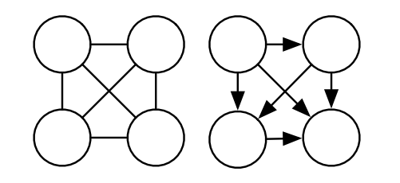
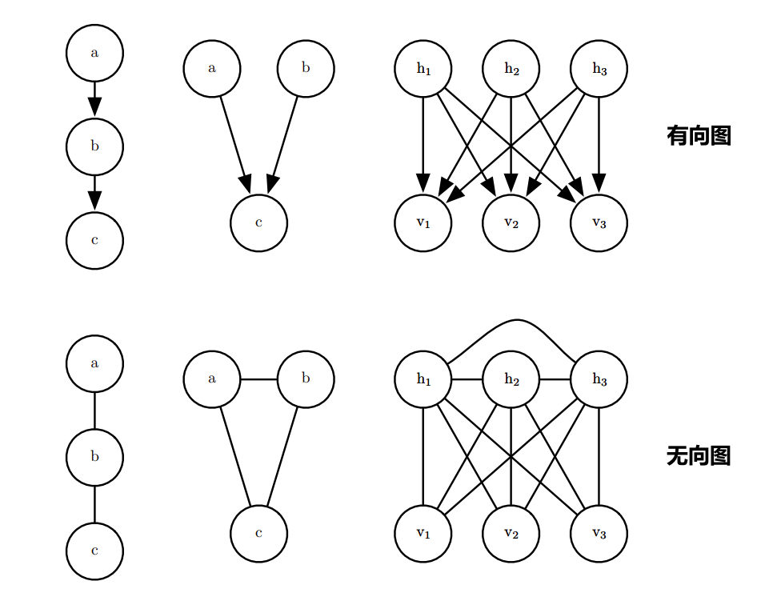
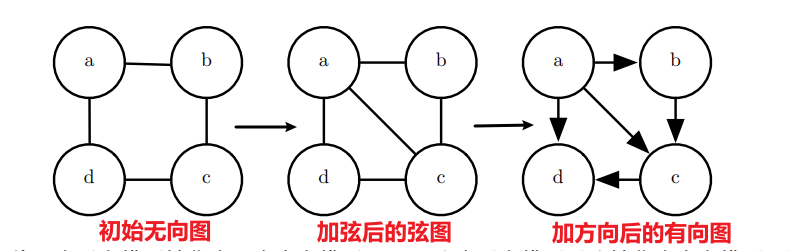
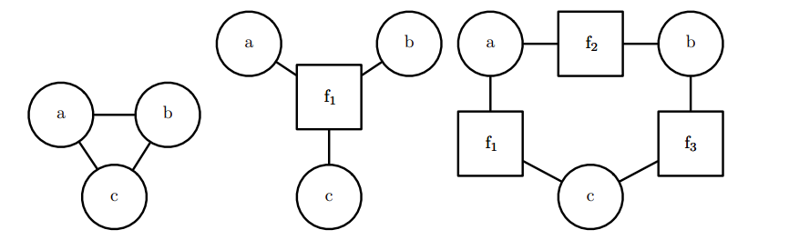

# 16. 结构化概率模型

## (一) 非结构化建模的挑战

### 概率模型的任务

- **估计密度函数**
  - 给定一个输入 x，机器学习系统返回一个对数据生成分布的真实密度函数 p(x) 的估计。
- **去噪**
  - 给定一个受损的或者观察有误的输入数据 x ，机器学习系统返回一个对原始的真实 x 的估计。
- **缺失值的填补**
  - 给定 x 的某些元素作为观察值，模型被要求返回**部分或全部未观察值**的估计/概率分布。
- **采样**
  - 模型从分布 p(x) 中抽取新的样本。

### 概率模型存在的问题

主要表现在面对**大规模随机变量**时。

#### 内存开销

- 假设x的分布为：n个离散变量，每个变量可取k个值。则可用含有$k^n$项的表格(或Python中的多维数组/字典)表示 P(x)。离散变量的表格存储需要大量存储空间，尤其当变量数量多时，内存开销巨大。

[这里](../code/概率模型的内存开销.py)是一段简单的python代码示例。

#### 统计开销

参数越多，训练数据需求越大，容易导致**过拟合**。

#### 推理开销

计算**边缘分布**或**条件分布**需要对整个表格的部分项进行求和，导致运行时间与内存开销同级别。

#### 采样开销

从模型中采样需要遍历表格，最差情况下需要指数级别时间。

## (二) 使用图描述模型结构

### 1. 图论

在学习**结构化概率模型**之前，了解**图论**的相关知识非常重要，因为很多概率模型（如**贝叶斯网络**和**马尔可夫随机场**）都可以用图来表示。图论是研究图这种数学结构的学科，图论中的概念为我们描述和分析复杂的概率关系提供了有力工具。

#### 基本概念

1. **图（Graph）**：由**节点**（vertices）和**边**（edges）组成，表示对象及其关系。
   - **有向图**：边有方向，表示单向关系。
   - **无向图**：边无方向，表示双向关系。

2. **节点（Node/Vertex）**：图中的基本元素，代表个体或变量。

3. **边（Edge）**：连接节点的线，表示节点间的关系。

4. **邻居（Neighbors）**：通过边相连的节点，表示两个变量直接相关。

5. **路径（Path）**：从一个节点到另一个节点的连接方式。

6. **环（Cycle）**：路径起点和终点是同一个节点。

#### 图的类型

1. **有向无环图（Directed Acyclic Graph, DAG）**：
   - **DAG** 是一种没有环的有向图。在概率模型中，DAG 通常用于构建**贝叶斯网络**。每个节点表示一个随机变量，有向边表示因果关系或条件依赖关系。
   - **无环性**意味着从一个节点出发，无法通过有向边返回该节点。

2. **无向图（Undirected Graph）**：
   - 无向图的边没有方向，表示两个节点之间的对称依赖关系。无向图可表示变量之间的联合概率分布，常用于**马尔可夫随机场（Markov Random Field, MRF）**等模型。

### 2. 有向图模型(Directed Graph Model)

每个箭头方向表示某个变量的概率依赖于另一个变量，也称为**信念网络（Belief Network）**或**贝叶斯网络（Bayesian Network）**。

#### 基本概念

在有向图模型中，变量间的关系是通过条件概率分布定义的。例如，如果有一个箭头从变量 \(a\) 指向 \(b\)，意味着我们用条件概率 \(P(b|a)\) 表示 \(b\) 的概率分布。这种条件依赖结构使得我们能够明确地表示一个变量如何被其他变量影响。

#### 数学表示

在有向图模型中，联合概率分布可以分解为各个条件概率的乘积形式。假设有 \(n\) 个变量 \(x_1, x_2, ..., x_n\)，其中每个变量的分布依赖于它的父节点（父节点是通过图中的箭头指向该节点的变量），变量的**联合概率分布**可以表示为：

\[
p(x) = \prod_{i} p(x_i | Pa \mathcal{G}(x_i))
\]

其中，\(Pa_\mathcal{G}(x_i)\) 表示变量 \(x_i\) 的所有父节点。

#### 有向图模型的优势

相较于直接存储联合分布的查表法，有向图模型的显著优势在于其**存储和计算效率**。

##### **存储效率**

假设有3个变量，每个变量有 100 个可能取值。直接存储联合概率分布需要 \(100^3 - 1 \) 个参数，而使用有向图模型，只需存储 \(19,899\) 个参数，大大减少了存储开销。

- **19899**的得出:
  - \( t_0 \) 作为独立变量，只需存储其 99 个参数：\( t_0: 100 - 1 = 99 \)
  - \( t_1 \) 的分布依赖于 \( t_0 \)：\( t_0 \to t_1: 100(t_0) \times 99(t_1) = 9900 \)
  - \( t_2 \) 的分布依赖于 \( t_1 \)：\( t_1 \to t_2: 100(t_1) \times 99(t_2) = 9900 \)
  - 求和：\( 99 + 9900 + 9900 = 19899 \)

#### **计算效率**

通常情况下，对于 \(n\) 个变量，每个变量有 \(k\) 个可能取值，直接查表法的复杂度是 \(O(k^n)\)。但是有向图模型中，每个变量的概率分布只与它的直接**前驱变量**（父节点）相关，复杂度可以降低到 \(O(k^m)\)，其中 \(m\) 是单个条件分布中最大父节点的数量。当 \(m \ll n\) 时，计算效率显著提高。

### 3. 无向图模型(Undirected Graph Model)

所有边均无方向，也称为**马尔科夫随机场/马尔科夫网络**。无向图模型不直接表示变量之间的**因果关系**，而是强调它们的**直接相互作用**。

#### 团（Clique）与团势能（Clique Potential）

在无向图中，一个**团**（clique）是节点的一个**完全连接子集**，意味着子集中任意两个节点之间都有一条边。

每个团都有一个对应的**因子**（factor）或**团势能**（clique potential）\( \phi(C) \)，用于衡量团中变量每一种可能的联合状态的**密切程度**。因子/团势能均被限制为**非负的**。

#### 未归一化概率函数(Unnormalized probability function)

##### 定义

$$
\tilde{p}(x) = \prod_{C \in \mathcal{G}} \phi(C)
$$
其中$\phi(C)$表示上文提到的**因子/团势能**。

未归一化概率函数在无向图模型中起到连接复杂概率关系和实际应用的**桥梁**作用。

#### 配分函数与归一化

由于未归一化的概率函数不能保证所有概率之和为 1，为了确保模型输出有效的概率分布，我们需要使用**配分函数**（partition function）\( Z \)，它确保所有的概率之和或积分为 1：
$$
p(x) = \frac{1}{Z} \tilde{p}(x)
$$
其中，配分函数 \( Z \) 通常通过对所有可能状态 \( x \) 的联合分布空间求和或积分得到：
$$
{Z} = \int \tilde{p}(x) \, \mathbb{d}x
$$
在实际应用中，计算 \( Z \) 可能非常复杂。为此，我们需要设计**模型的结构和因子的定义**，使得 \( Z \) 的计算尽可能高效。

#### 基于能量的模型(Energy-based model,EBM)

$$
\tilde{p}(x) = \exp(-E(x))
$$

$E(x)$：**能量函数(Energy function)**，显然$\tilde{p}(x)$恒正。符合上式的分布可被称为**玻尔兹曼分布(Boltzmann distribution)**，具有该分布的模型被称为**玻尔兹曼机(Boltzmann Machine)。**没有**潜变量**(**latent variables**，在模型中不可观测的隐含特征或状态，如模型学习到的潜在特征或结构)的玻尔兹曼机被称为**马尔可夫随机场**或**对数线性模型**。

##### 专家(Expert)

根据$$\exp(a + b) = \exp(a) \cdot \exp(b)$$，能量函数可被拆为$\exp(a)$,$\exp(b)$等**多个项**，对应无向模型中的**不同团**，每个团都可被视为一个“**专家**”，决定一个特定的软约束是否能够被满足；每个专家执行的一个约束，对应随机变量的一个**低维投影**。不同专家的乘法，共同构成了复杂的高维约束。

例如书中的无向图模型：$E_{a,b}(a, b)$,$E_{b,c}(b, c)$等均可被视为不同“专家”，所有专家/项共同构成整体能量函数$E(a,b,c,d,e,f)$。
$$
E(a, b, c, d, e, f) = E_{a,b}(a, b) + E_{b,c}(b, c) + E_{a,d}(a, d) + E_{b,e}(b, e) + E_{e,f}(e, f)
$$

### 16.2.4 有向模型和无向模型的转换

#### 图模型的期望

既能捕捉到足够的独立性信息，又不引入虚假的独立性假设，**平衡复杂性和独立性**。

##### 最坏情况：完全图

完全图假设**所有变量之间都有相互作用**。虽然能够表示*意概率分布，但它并不能有效利用独立性信息，从而无法简化模型。

- 有向模型中的完全图(右)：排序变量->确保每个变量的父节点都是排在它之前的节点。排序方式不唯一。
- 无向模型中的完全图(左)：相当于一个**团**。

#### 有向<->无向模型互化

##### **有向模型->无向模型：道德化（Moralization）**

- **不道德(immorality)**：a与b同为c的父节点，但a与b相互独立。
  - `a->c && b->c && !(a->b || b->a)`
- 道德化：
  - 对于有向图中的每一对父节点，如果它们没有直接边相连，就在无向图中为它们添加一条无向边。
    - 添加无向边->丢失独立性，引入新的直接依赖
  - 移除有向边的方向，使图成为无向图。

##### **无向模型->有向模型：三角形化（Triangulation）**

###### **概念**

- **环(loop)**：a-b-c-d-a
- **弦(chord)**：环中任意两个**非连续变量**之间的连接(如a-c,b-d)
  - a-b-c-d-a && (**a-c || b-d**)

###### **转化方法**

1. 确保无向图中的每一个**长度大于3的环**都有弦，即**任意两个不相邻的节点通过一条额外的边相连**。不满足该条件的环，需要首先添加弦，才能进行下一步；添加弦后的图被称为“弦图”(chordal graph)或“三角形化图”(triangulated graph)。
2. 为每条边指定方向，根据节点排序顺序构建有向图，注意应保证**不能在转化后的有向图中产生有向循环**(如a->b->c->a)。

###### **为什么要保证有向图中不能出现有向循环？**

- 有向概率模型要求所有变量的依赖关系必须可以表示为有向无环图（DAG），出现有向循环（反馈环路）将导致无法定义有效的**联合概率分布**；
  - 联合概率分布的定义依赖于**无环性**：
    - 有向概率模型使用**链式规则**来定义联合概率分布。对于每个变量 \(X_i\)，其条件概率 \(P(X_i | \text{Parents}(X_i))\) 依赖于它的父节点。如果存在循环，这意味着某个变量的条件概率会依赖于自己或间接依赖于自己，导致**递归定义**，进而无法计算出有效的联合概率分布。
  - 同时，有向循环也破坏了DAG的**条件独立性**表达。DAG的优势在于，变量之间的条件独立性可以通过观察父节点关系或通过图中的路径来推导，有向循环导致这种**独立性关系**变得不再明确。
- 因此，必须确保有向图的**无环性**。

#### 有向模型和无向模型的抉择

- **任务需求**：有向模型更适合进行**采样**，无向模型更适合**推断**。

- 有向模型：**原始采样(Ancestral Sampling)**，通过**拓扑排序**排列模型中的变量，从无父节点的变量开始，依次根据条件概率采样。
  - **拓扑排序**：**确保父节点都在其子节点之前采样**，否则会出现错误。(联想：使用未初始化的局部变量是不可接受的)
    - 理论依据：联合分布的**链式法则**。$$P(x_1, x_2, \ldots, x_n) = \prod_{i=1}^{n} P(x_i \mid \text{Pa}(x_i))$$
  - 局限性：仅适用于有向图；难以获取**后验分布**(给定观测数据后，更新某些变量的概率分布)

- 无向模型：**推断**，从已知信息中推测未知信息，从已知变量\( v \)推测潜在变量\( h \)。推断潜变量并不是因为我们好奇，而是模型训练所需。例如，在模型参数优化的常用方法：**最大似然估计(Maximum Likelihood Estimation，MLE)**中，\( p(h|v) \)的计算必须用到潜变量\( h \)的值。
    $$
    \log p(v) = \mathbb{E}_{h \sim p(h|v)} \left[ \log p(h,v) - \log p(h|v) \right]
    $$

推断问题在理论上很好理解，但在实际深度学习应用中却可能极为复杂。推断问题属于 **#P-hard**(不仅要找到问题的一个解，还要计算所有可能解的数量（判定+计数），而**NP-hard**只需找到一个解（计数）)。

有关[Boolean satisfiability problem](https://en.wikipedia.org/wiki/Boolean_satisfiability_problem)、[#P-complete](https://en.wikipedia.org/wiki/%E2%99%AFP-complete)和[NP-complete](https://en.wikipedia.org/wiki/NP-completeness)的详细解释，可参考**超链接**指向的维基百科页面。

书中提到的**3-SAT(Satisfiability) Problem**是一个典型的NP-hard问题，也是SAT Problem在**布尔表达式每个子句(clause)的变量个数均为3**时的一个特例。我们可以简单地将3-SAT理解为：在下面的布尔表达式中，能否找出一组 \( x_1 \) ~ \( x_6 \) 的值，使得下面的**合取式**成立，其中每个子句均由**三个变量或变量取反**构成。

$$
(x_1 \vee \neg x_2 \vee x_3) \wedge (\neg x_1 \vee x_4 \vee \neg x_3) \wedge (x_2 \vee \neg x_4 \vee x_5) \wedge (\neg x_3 \vee x_5 \vee \neg x_1)
$$

我们可以很容易想象到，随着子句个数与变量个数不断增加，变量组合的数量将指数级增长，找到一个可满足的条件将变得越来越复杂。

所以，面对推断问题的计算挑战，我们需要采取更高效的方法，如**近似推断(approximate inference)**。具体请见花书的第十九章：本章笔记撰写者暂时还未读到，所以还请读者自行寻找答案:)

### 16.2.5 因子图(factor graph)

#### 什么是因子图？

**因子图**是一种基于无向模型的特殊表示方式，它能够更清晰地展示模型中的因子和变量之间的依赖关系。与传统的无向图不同，因子图通过区分**变量节点**和**因子节点**，使得每一个因子的作用域能够被明确表示，从而避免了无向图中的模糊性。

- **变量节点**：表示**随机变量**，通常使用圆圈表示。
- **因子节点**：表示**未归一化的概率分布函数** \( \phi \)，使用方块表示。

因子图中，变量节点和因子节点之间通过无向边连接。每一条边表示该**变量**被包含在该**因子**的作用范围内。**变量节点不能直接连接到其他变量节点，因子节点也不能直接连接到其他因子节点**。这确保了图的结构能够明确地表达变量与因子之间的关系。

#### 为什么要用因子图？

在无向图中，特别是在处理较为复杂的团时，存在**团势能的模糊性**。例如，一个由三个变量 \( a \)、\( b \)、\( c \) 组成的团可以被解释为一个涉及三个变量的单一因子，也可以是三个两两变量间的因子组合。我们难以确定某个团是否对应一个整体的因子，还是多个较小因子。这种不确定性使得在推断和计算中难以确定最佳的计算方式。

因子图通过显式地表示每个因子的作用域，解决了图表达模糊性的问题。在一些应用场景中，因子图可以将复杂的**全局**依赖关系分解为多个**局部**依赖，使得计算代价显著降低。

#### 插图分析：三变量模型

变量\( a \)、\( b \) 和 \( c \)组成一个团，因子图不同的表示方法赋予其不同的含义：左图为最简单的三变量无向图；中图表示 \( a \)、\( b \)、\( c \) 三变量之间存在全局依赖关系，由作用域为\( \{a, b, c\} \)的单一全局因子\( \phi_1 \)关联；右图中的三个局部因子 \( \phi_1 \)、\( \phi_2 \) 和 \( \phi_3 \)，各自关联两个变量，这种表示方式可将全局依赖拆解为局部依赖，便于计算。

## (三) 如何学习依赖关系？

在深度学习中，生成模型通过学习数据分布生成样本。通常可见变量（v）之间的复杂依赖关系需要潜变量（h）来捕捉。

### 直接建模的挑战

- 如果不包含潜变量，直接在贝叶斯网络或马尔可夫网络中建模**可见变量**的依赖，需要较高的计算复杂度和大量参数。我们通常不可能连接所有可见变量，也不宜完全摒弃潜变量。

### 结构学习的解决方案，以及潜变量的优势

- **结构学习(Structure learning)**通过**贪婪搜索**找到合适的模型结构，但过程耗时且不一定最优。潜变量的引入，避免了离散搜索和多轮训练，简化了依赖关系的建模，能够高效地描述边缘分布\( p(v) \)。除此之外，潜变量还提供了原始变量的**替代表示**。

## (四) 深度学习模型与传统的结构化概率模型的差异

1. **模型深度定义**：
   - **深度学习**：模型的深度通过计算图定义，可能没有潜变量或只有**单个**大的潜变量层。
   - **传统图模型**：深度由图模型的结构决定，通过**潜变量到可观察变量的最短路径**定义。

2. **潜变量设计**  
   - 深度学习：潜变量的设计更加灵活，通常**不希望**在训练前赋予潜变量特定含义，允许模型根据数据自我构建概念；采用**分布式表示**的思想，通过多个潜变量的间接连接，表现变量之间复杂的非线性相互作用。
     - 大量的潜变量，也使得高效的**数值计算**代码显得格外重要。
   - 传统模型：潜变量往往数量较少，并具有**特定含义**（如文档主题、学生智力等）。通常使用**高阶项**和**结构学习**来捕获变量之间复杂的非线性相互作用。

3. **连接方式**  
   - 深度学习：常采用**全连接**的方式，多个隐藏单元与可见单元之间的相互作用可通过**单个矩阵**描述。
   - 传统模型：连接较少，连接选择可**单独设计**，保持精确推断的可解性。

4. **对未知量的容忍度**  
   - 深度学习：更高容忍度，直接使用数据进行训练，即使目标函数难以处理也能通过高效梯度估计近似训练。
   - 传统模型：倾向于简化模型，以便精确计算每个量。
