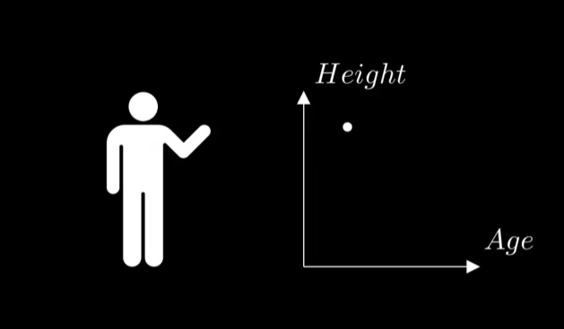
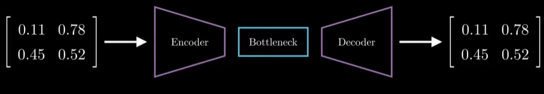
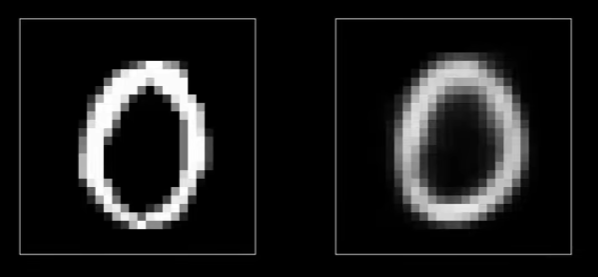
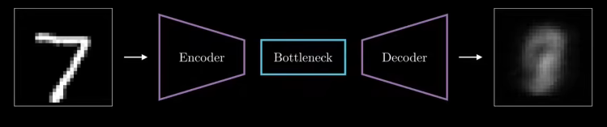
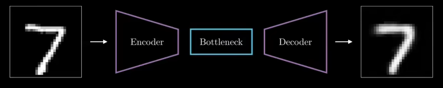
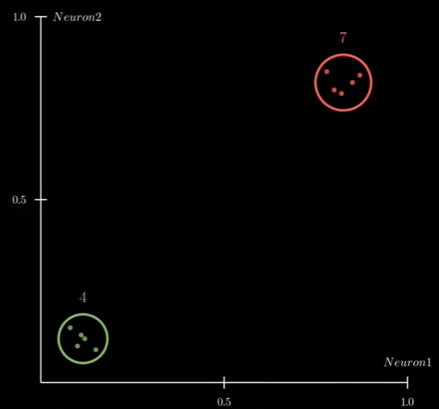
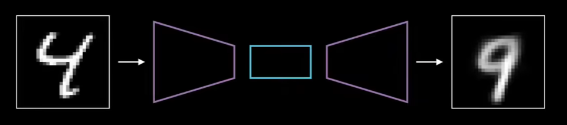

# 自编码器

## 什么是自编码器（AE）？
自编码器是一种用于学习数据有效表示的人工神经网络。这意味着模型试图用尽可能少的特征，来描述非常大的数据。更简单地来说，想象你要向一个朋友描述一个人，你可以从描述他们的发型、身高、性别、年龄或者肤色开始。最终，你可能会决定只用身高和年龄来描述这个人，如下图，这可能不是最好的表示，但他肯定是非常紧凑的，因为他只有两个数字。自编码器基本上就做同样的事情，但用于不同的数据，同时，与传统的降维方法PCA不同，自编码器能够通过非线性映射提取更复杂的特征。



## 基本架构

自编码器的基本架构，由三个主要组成部分，分别是编码器、潜在空间（瓶颈）和解码器。其数学表示如下：

### 1. **编码器**
编码器将高维数据 $x$ 映射到一个低维潜在空间 $z$：

$$
z = f(x) = \sigma(Wx + b)
$$

其中：$W$ 是权重矩阵, $b$ 是偏置向量，而 $\sigma$ 是激活函数

### 2. **解码器**
解码器的任务是将潜在表示 $z$ 还原为高维数据 $\hat{x}$：

$$
\hat{x} = g(z) = \sigma'(W'z + b')
$$

其中 $\sigma'$ 是另一个激活函数，通常与编码器使用的激活函数不同。

编码器将输入数据压缩成潜在空间表示，这个潜在空间是一个低维空间，捕捉输入数据的低维特征，瓶颈层，即网络中最小的层，会保存这个压缩表示，最后，解码器从编码器和潜在空间产生的压缩表示中，重建输入数据。



另一个常见的例子是编码图像，编码器可以将图像减小到几个关键特征，潜在空间保存这些关键特征，解码器从这些低维特征重建图像，那我们如何去训练自编码器这个网络呢？

## 训练目标
训练自编码器的重点是最小化原始数据与其重建版本数据之间的差异，目标是提高解码器从其压缩表示准确重建原始数据的能力。同时也为了编码器在其压缩数据的方式上变得更好，从而能保留关键信息，确保原始数据可以有效地重建。

但我们如何测量两幅图像之间的差异呢？显然，比较两幅图像的最简单方法是逐个像素进行比较。例如，我们可以计算对应像素之间的差异，然后取这些差异的平均值，这种方法称为均方误差（MSC）,它也是一种损失函数。其公式如下，我们可以看到每个差异都被平方处理，以确保其为正，从而避免了出现负数的麻烦。

$$
L(x, \hat{x}) = \frac{1}{n} \sum_{i=1}^{n} (x_i - \hat{x}_i)^2
$$

在这其中：$x$ 是原始数据，$\hat{x}$ 是重建数据，$n$ 是数据的维度。



在训练过程中，自编码器通过尝试减少它处理的每张图像的均方误差来学习。一个典型的训练场景如下：



一开始，由于自编码器的权重是随机设置的，所以重建的误差很高。但随着训练的进展，自编码器向着减少图像均方误差的方向进行训练，这个过程采用最小化损失函数的方法（通常采用梯度下降）来调整网络的权重和偏置，从而让误差越来越少，进而在准确重现原始图像方面变得更好，现在再次观察，已经与输入的图像非常相似了。



## 潜在空间讨论

现在，我们已经基本了解自编码器从其潜在表示中学习重建图像的原理。而我们为何采用潜在空间进行数据降维，然后进一步重建这种方式呢？其实，自编码器当中潜在空间的维度由其中神经元的数量所决定，当潜在空间中有两个神经元，那么此时潜在空间就是二维的，同理，如果有三个神经元，那么潜在空间就是三维的。

在这里，我们立足于二维平面空间进行讨论，我们可以将两个神经元的激活值作为坐标轴，将输入数据映射到这个二维空间，来可视化每个数据点是如何编码的。如果第一个神经元强烈激活（横轴），那么编码将表示在该图的右侧，如果第二个神经元强烈激活（纵轴），那么编码将表示在该图的顶部。举个简单的例子，如果说我将多个数字7的图像进行编码，如果训练效果较好，那么我们就会发现数字7的每个实例都会进入潜在空间的相同区域，这里，我们把这个区域称作簇。

现在，如果对不同的数字进行编码，例如数字4，这些实例也会形成一个簇。在同样理想的情况下，这个簇应该与其他类别的簇相隔很远。如下图，在训练过程中，随着训练的收敛，潜在空间逐渐变得有组织，每个类别占据着自己的独特区域。



我们回到潜在空间维度的讨论。潜在空间当中的维度由神经元的个数所决定，且一一对应。如果潜在空间太小，比如一维，即使训练了很长的时间，自编码器也可能难以识别数据的基本特征，这导致最终的重建质量差。比如，将4重建成9，这种重建错误的情况，在低维的潜在空间是很有可能发生的，此时，适当提升潜在空间的维度，则可以改善这个问题。



## 代码实现

### 1 加载数据

我们将使用Keras中的MNIST数据集，这是一个非常流行的手写数字图像数据集。MNIST数据集包含28x28像素的灰度图像和对应的数字标签。我们将使用这些图像来构建和训练自编码器。

```python
from tensorflow.keras.datasets import mnist

# 加载MNIST数据集
(x_train, _), (x_test, _) = mnist.load_data()
```

在此代码中，`x_train` 和 `x_test` 是MNIST数据集中训练集和测试集的图像数据。我们仅使用图像部分，忽略标签（即`_`部分），因为自编码器是一种无监督学习模型。

### 2 数据预处理

为了让模型更好地处理图像数据，我们需要对数据进行归一化处理。图像的像素值范围是0到255，归一化后将这些值缩放到0到1之间。此外，我们还需要将28x28的图像展平成一维数组以便输入到神经网络中。

```python
# 归一化处理，将像素值缩放到0到1之间
x_train = x_train.astype('float32') / 255.
x_test = x_test.astype('float32') / 255.

# 将图像展平为一维数组，方便输入到网络中
x_train = x_train.reshape((len(x_train), -1))
x_test = x_test.reshape((len(x_test), -1))
```

### 3 构建自编码器

自编码器由两个主要部分构成：编码器和解码器。编码器负责将输入数据压缩为低维的潜在表示，解码器则负责从这个低维表示重建原始数据。下面是自编码器的实现过程。

```python
from tensorflow.keras.layers import Input, Dense
from tensorflow.keras.models import Model

# 输入维度：28x28图像展平成784维
input_dim = x_train.shape[1]
encoding_dim = 32  # 将图像压缩到32维

# 构建编码器
input_img = Input(shape=(input_dim,))
encoded = Dense(encoding_dim, activation='relu')(input_img)

# 构建解码器
decoded = Dense(input_dim, activation='sigmoid')(encoded)

# 自编码器模型
autoencoder = Model(input_img, decoded)
```

其中，`input_dim` 是输入层的维度，即每张展平图像的维度（784）。而 `encoding_dim` 是瓶颈层的维度，即压缩后的潜在空间大小（32维）。

### 4 编译和训练模型

在模型编译阶段，我们选择了`adam`作为优化器，`binary_crossentropy`作为损失函数。接下来，我们通过训练模型来让自编码器学会如何重建输入数据。

```python
# 编译模型
autoencoder.compile(optimizer='adam', loss='binary_crossentropy')

# 训练模型
autoencoder.fit(x_train, x_train,
                epochs=50,
                batch_size=256,
                shuffle=True,
                validation_data=(x_test, x_test))
```

这里，`x_train`和`x_test`不仅仅作为输入数据，还作为标签数据，因为自编码器的目标是重建输入数据本身。

#### 2.5 获取潜在表示并重建图像

我们可以使用训练好的自编码器来获取测试数据的低维潜在表示，并使用解码器来重建原始图像。

```python
# 使用编码器模型获取潜在表示
encoder = Model(input_img, encoded)
encoded_imgs = encoder.predict(x_test)

# 使用自编码器重建图像
decoded_imgs = autoencoder.predict(x_test)
```

#### 2.6 可视化结果

我们通过将原始图像与重建图像进行对比，来查看自编码器的性能。

```python
import matplotlib.pyplot as plt

# 显示原始图像和重建图像
n = 10  # 显示10个图像
plt.figure(figsize=(20, 4))
for i in range(n):
    # 显示原始图像
    ax = plt.subplot(2, n, i + 1)
    plt.imshow(x_test[i].reshape(28, 28))
    plt.gray()
    ax.get_xaxis().set_visible(False)
    ax.get_yaxis().set_visible(False)

    # 显示重建图像
    ax = plt.subplot(2, n, i + 1 + n)
    plt.imshow(decoded_imgs[i].reshape(28, 28))
    plt.gray()
    ax.get_xaxis().set_visible(False)
    ax.get_yaxis().set_visible(False)
plt.show()
```

在这个可视化结果中，上半部分显示的是原始的测试集图像，下半部分显示的是自编码器根据潜在表示重建的图像。通过比较两者，我们可以观察到自编码器的重建效果。

## 总结
本次实现展示了一个简单的自编码器在MNIST数据集上的应用，通过编码器将图像压缩至低维潜在空间，并通过解码器重建图像。结果表明，自编码器能够在保持数据主要特征的同时，成功压缩并重建出接近原始的图像，从而实现了数据的有效降维和重建能力。这演示了自编码器在无监督学习中的强大应用，尤其是在数据压缩和特征提取方面。

## 附录
### 完整代码实现

```python
import numpy as np
import matplotlib.pyplot as plt
from tensorflow.keras.layers import Input, Dense
from tensorflow.keras.models import Model
from tensorflow.keras.datasets import mnist

# 1. 加载数据
(x_train, _), (x_test, _) = mnist.load_data()

# 2. 数据预处理
# 归一化处理，将像素值缩放到0到1之间
x_train = x_train.astype('float32') / 255.
x_test = x_test.astype('float32') / 255.

# 将图像展平为一维数组
x_train = x_train.reshape((len(x_train), -1))
x_test = x_test.reshape((len(x_test), -1))

# 3. 构建自编码器
# 输入维度：28x28图像展平成784维
input_dim = x_train.shape[1]
encoding_dim = 32  # 将图像压缩到32维

# 构建编码器
input_img = Input(shape=(input_dim,))
encoded = Dense(encoding_dim, activation='relu')(input_img)

# 构建解码器
decoded = Dense(input_dim, activation='sigmoid')(encoded)

# 自编码器模型
autoencoder = Model(input_img, decoded)

# 编码器模型
encoder = Model(input_img, encoded)

# 4. 编译模型
autoencoder.compile(optimizer='adam', loss='binary_crossentropy')

# 5. 训练模型
autoencoder.fit(x_train, x_train,
                epochs=50,
                batch_size=256,
                shuffle=True,
                validation_data=(x_test, x_test))

# 6. 获取潜在表示和重建图像
# 使用编码器获取潜在表示
encoded_imgs = encoder.predict(x_test)

# 使用自编码器重建图像
decoded_imgs = autoencoder.predict(x_test)

# 7. 可视化结果
n = 10  # 显示10个图像
plt.figure(figsize=(20, 4))
for i in range(n):
    # 显示原始图像
    ax = plt.subplot(2, n, i + 1)
    plt.imshow(x_test[i].reshape(28, 28))
    plt.gray()
    ax.get_xaxis().set_visible(False)
    ax.get_yaxis().set_visible(False)

    # 显示重建图像
    ax = plt.subplot(2, n, i + 1 + n)
    plt.imshow(decoded_imgs[i].reshape(28, 28))
    plt.gray()
    ax.get_xaxis().set_visible(False)
    ax.get_yaxis().set_visible(False)
plt.show()
```

## 参考资料

1. **Hinton, G. E., & Zemel, R. S. (2006).** Reducing the dimensionality of data with neural networks. *Science*, 313(5786), 504-507. [pdf](https://www.cs.toronto.edu/~hinton/science.pdf)

2. **Autoencoders | Deep Learning Animated** [Link](https://www.youtube.com/watch?v=hZ4a4NgM3u0)

3. **François Chollet, Building Autoencoders in Keras**. *Keras Blog*. [Link](https://blog.keras.io/building-autoencoders-in-keras.html)